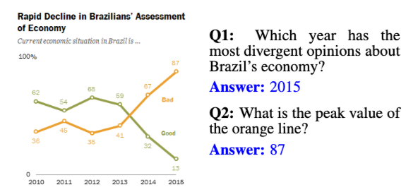
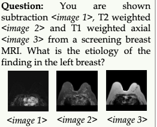
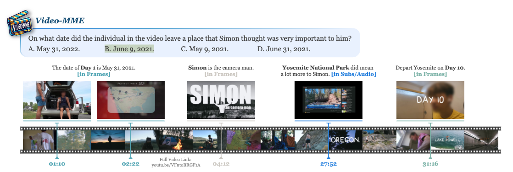
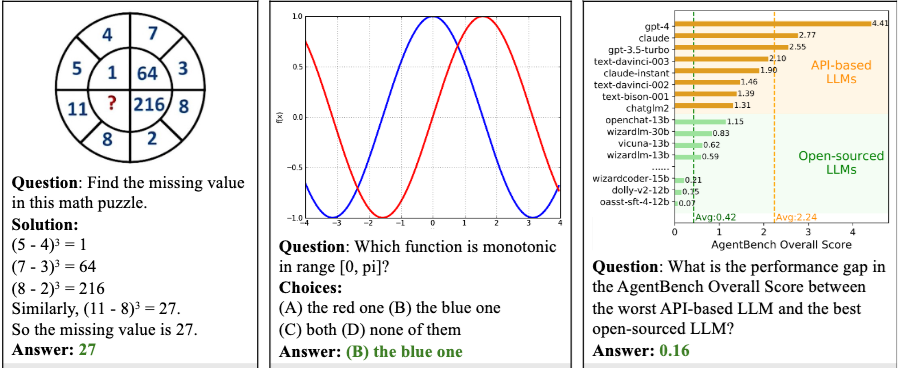
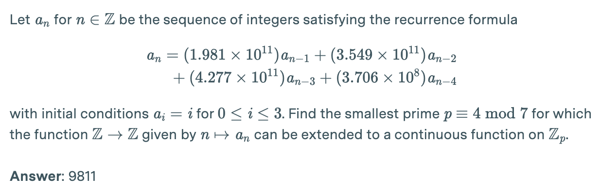
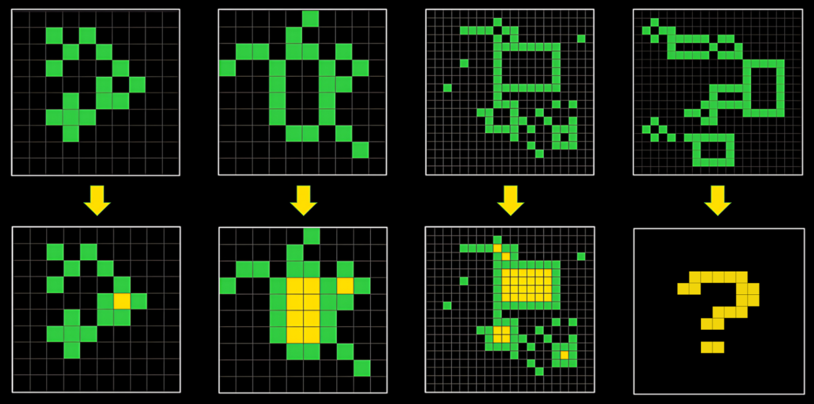

# Appendix: Frontier Scores on Benchmarks, with Examples 

| Factual question answering                                                                                                                                                                               | High Score (pass@1)Jun 2025                                                                                                        | Example Question                                                                                                                                                                                                                                                                                                                                                                                                                                                                                                                                                                                                                                                                                                                                                                                                                                                                                                                                                                                                                                                   |
|:---------------------------------------------------------------------------------------------------------------------------------------------------------------------------------------------------------|------------------------------------------------------------------------------------------------------------------------------------|--------------------------------------------------------------------------------------------------------------------------------------------------------------------------------------------------------------------------------------------------------------------------------------------------------------------------------------------------------------------------------------------------------------------------------------------------------------------------------------------------------------------------------------------------------------------------------------------------------------------------------------------------------------------------------------------------------------------------------------------------------------------------------------------------------------------------------------------------------------------------------------------------------------------------------------------------------------------------------------------------------------------------------------------------------------------|
| [MMLU Pro](https://arxiv.org/abs/2406.01574)) *\- undergraduate knowledge and reasoning.*                                                                            | 85.6% ([o3][https://openai.com/index/learning-to-reason-with-llms/)(https://www.vals.ai/benchmarks/mmlu_pro-04-18-2025))                                                                 | *If 4 daps \= 7 yaps, and 5 yaps \= 3 baps, how many daps equal 42 baps? (A) 28 (B) 21 (C) 40 (D) 30\. One of the reasons that the government discourages and regulates monopolies is that: (A) producer surplus is lost and consumer surplus is gained; (B) … ; (C); (D).*                                                                                                                                                                                                                                                                                                                                                                                                                                                                                                                                                                                                                                                                                                                                                                                        |
| [GAIA](https://arxiv.org/abs/2311.12983) \- *questions requiring internet access.*                                                                                                                       | 58% ([Claude 3.5 Sonnet](https://huggingface.co/spaces/gaia-benchmark/leaderboard))                                                | *“What was the actual enrollment count of the clinical trial on H. pylori in acne vulgaris patients from Jan-May 2018 as listed on the NIH website?”*                                                                                                                                                                                                                                                                                                                                                                                                                                                                                                                                                                                                                                                                                                                                                                                                                                                                                                              |
| [SimpleQA](https://arxiv.org/pdf/2411.04368) \- *obscure questions.*                                                                                                                                     | 63% ([GPT-4.5](https://arxiv.org/pdf/2411.04368))                                                                                  | *“Which Dutch player scored an open-play goal in the 2022 Netherlands vs Argentina game in the men’s FIFA World Cup?”*                                                                                                                                                                                                                                                                                                                                                                                                                                                                                                                                                                                                                                                                                                                                                                                                                                                                                                                                             |
|                                                                                                                                                                                                          |                                                                                                                                    |                                                                                                                                                                                                                                                                                                                                                                                                                                                                                                                                                                                                                                                                                                                                                                                                                                                                                                                                                                                                                                                                    |
|                                                                                                                                                                                                          |                                                                                                                                    |                                                                                                                                                                                                                                                                                                                                                                                                                                                                                                                                                                                                                                                                                                                                                                                                                                                                                                                                                                                                                                                                    |
| **Visual question answering**                                                                                                                                                                            |                                                                                                                                    |                                                                                                                                                                                                                                                                                                                                                                                                                                                                                                                                                                                                                                                                                                                                                                                                                                                                                                                                                                                                                                                                    |
| [ChartQA](https://arxiv.org/pdf/2203.10244) \- *questions about charts*                                                                                                                                  | 91% ([Claude 3.5 Sonnet](https://www-cdn.anthropic.com/fed9cc193a14b84131812372d8d5857f8f304c52/Model_Card_Claude_3_Addendum.pdf)) |                                                                                                                                                                                                                                                                                                                                                                                                                                                                                                                                                                                                                                                                                                                                                                                                                                                                                                                                                                                                                                             |
| [MMMU](https://arxiv.org/abs/2311.16502) \- *visual Q\&A*.                                                                                                                                               | 84% ([Gemini 2.5-Pro](https://mmmu-benchmark.github.io/#leaderboard))                                                              |                                                                                                                                                                                                                                                                                                                                                                                                                                                                                                                                                                                                                                                                                                                                                                                                                                                                                                                                                                                                                                             |
| [VideoMME](https://video-mme.github.io/home_page.html) \- *questions about video*                                                                                                                        | 75% ([Gemini 1.5 Pro (Last Update: June 2024)](https://video-mme.github.io/home_page.html))                                        |                                                                                                                                                                                                                                                                                                                                                                                                                                                                                                                                                                                                                                                                                                                                                                                                                                                                                                                                                                                                                                             |
|                                                                                                                                                                                                          |                                                                                                                                    |                                                                                                                                                                                                                                                                                                                                                                                                                                                                                                                                                                                                                                                                                                                                                                                                                                                                                                                                                                                                                                                                    |
| **Math**                                                                                                                                                                                                 |                                                                                                                                    |                                                                                                                                                                                                                                                                                                                                                                                                                                                                                                                                                                                                                                                                                                                                                                                                                                                                                                                                                                                                                                                                    |
| [MATH](https://arxiv.org/abs/2103.03874) \- *math problems.*                                                                                                                                             | 95% ([o1](https://openai.com/index/learning-to-reason-with-llms/))                                                                 | *Tom has a red marble, a green marble, a blue marble, and three identical yellow marbles. How many different groups of two marbles can Tom choose?*                                                                                                                                                                                                                                                                                                                                                                                                                                                                                                                                                                                                                                                                                                                                                                                                                                                                                                                |
| [AIME2024](https://artofproblemsolving.com/wiki/index.php/2025_AIME_I) \- *math competition problems*                                   | 96.7% (no tools) ([GPT-5 Pro](https://openai.com/index/introducing-gpt-5/))                                                            | *There exist real numbers ![$x$][image16] and ![$y$][image17], both greater than 1, such that ![$\\log\_x\\left(y^x\\right)=\\log\_y\\left(x^{4y}\\right)=10$][image18]. Find ![$xy$][image19].*                                                                                                                                                                                                                                                                                                                                                                                                                                                                                                                                                                                                                                                                                                                                                                                                                                                                   |
| [MathVista](https://mathvista.github.io/) \- *visual mathematical problems.*                                                                                                                             | 74% ([o1](https://openai.com/index/learning-to-reason-with-llms/))                                                                 | **                                                                                                                                                                                                                                                                                                                                                                                                                                                                                                                                                                                                                                                                                                                                                                                                                                                                                                                                                                                                                                          |
| [QuantBench](https://assets.ctfassets.net/kftzwdyauwt9/67qJD51Aur3eIc96iOfeOP/71551c3d223cd97e591aa89567306912/o1_system_card.pdf) \- *challenging interview questions from quantitative trading firms.* | 50% ([o1-m](https://assets.ctfassets.net/kftzwdyauwt9/67qJD51Aur3eIc96iOfeOP/71551c3d223cd97e591aa89567306912/o1_system_card.pdf)) | *“Two players, Alice and Bob, will play a game. Alice chooses any integer from 1 thru 9 (inclusive; all intervals are inclusive). Bob then chooses any integer from 1 thru 9, but can’t pick the number Alice just chose. Then Alice chooses any number from 1 thru 9 but can’t pick the number Bob just chose. They go on in this fashion and keep a running tally of all the chosen numbers so far. The first player to make this running tally reach exactly N (some positive integer) wins the game. A player can never choose a number that would make the tally be greater than N, and if a player cannot validly choose any numbers under the rules, then he/she loses the game. To clarify, numbers can potentially be repeated during the game, but just not consecutively. There is no guarantee that Bob will get a turn (for small enough N). If Alice and Bob each play with perfect strategies, what are the 3 smallest values of N such that Bob wins the game? Express your final answer as the corresponding option ‘A’, ‘B’, ‘C’, ‘D’, or ‘E’.”* |
| [FrontierMath Tiers 1-3](https://epochai.org/frontiermath/the-benchmark) \- *“expert-level mathematics problems that specialists spend days solving”*                                                              | 24.8% ([GPT-5 High](https://epochai.org/frontiermath/the-benchmark))                                                                      |                                                                                                                                                                                                                                                                                                                                                                                                                                                                                                                                                                                                                                                                                                                                                                                                                                                                                                                                                                                                                                             |
|                                                                                                                                                                                                          |                                                                                                                                    |                                                                                                                                                                                                                                                                                                                                                                                                                                                                                                                                                                                                                                                                                                                                                                                                                                                                                                                                                                                                                                                                    |
| **General reasoning**                                                                                                                                                                                    |                                                                                                                                    |                                                                                                                                                                                                                                                                                                                                                                                                                                                                                                                                                                                                                                                                                                                                                                                                                                                                                                                                                                                                                                                                    |
| [SAT](https://openai.com/index/gpt-4-research/)                                                                                                                                                          | 700/800 ([gpt-4](https://openai.com/index/gpt-4-research/))                                                                        | ![][image22]                                                                                                                                                                                                                                                                                                                                                                                                                                                                                                                                                                                                                                                                                                                                                                                                                                                                                                                                                                                                                                                       |
| [ARC-AGI](https://arcprize.org/leaderboard) \- *visual reasoning problems.*                                                                                                                              | 56% (MindAI)                                                                                                                       | **                                                                                                                                                                                                                                                                                                                                                                                                                                                                                                                                                                                                                                                                                                                                                                                                                                                                                                                                                                                                                                          |
|                                                                                                                                                                                                          |                                                                                                                                    |                                                                                                                                                                                                                                                                                                                                                                                                                                                                                                                                                                                                                                                                                                                                                                                                                                                                                                                                                                                                                                                                    |
|                                                                                                                                                                                                          |                                                                                                                                    |                                                                                                                                                                                                                                                                                                                                                                                                                                                                                                                                                                                                                                                                                                                                                                                                                                                                                                                                                                                                                                                                    |
| **Domain-Specific Reasoning**                                                                                                                                                                            |                                                                                                                                    |                                                                                                                                                                                                                                                                                                                                                                                                                                                                                                                                                                                                                                                                                                                                                                                                                                                                                                                                                                                                                                                                    |
| [GPQA Diamond](https://arxiv.org/abs/2311.12022) \- *graduate reasoning problems*                                                                                                                        | 77% ([o1](https://openai.com/index/learning-to-reason-with-llms/))                                                                 | *Methylcyclopentadiene was allowed to react with methyl isoamyl ketone and a catalytic amount of pyrrolidine. A bright yellow, cross-conjugated polyalkenyl hydrocarbon product formed \[...\] How many chemically distinct isomers make up the final product (not counting stereoisomers)? (a) 2, (b) 16, (c) 8, (d) 4\.*                                                                                                                                                                                                                                                                                                                                                                                                                                                                                                                                                                                                                                                                                                                                         |
|                                                                                                                                                                                                          |                                                                                                                                    |                                                                                                                                                                                                                                                                                                                                                                                                                                                                                                                                                                                                                                                                                                                                                                                                                                                                                                                                                                                                                                                                    |
| **Software Engineering**                                                                                                                                                                                 |                                                                                                                                    |                                                                                                                                                                                                                                                                                                                                                                                                                                                                                                                                                                                                                                                                                                                                                                                                                                                                                                                                                                                                                                                                    |
| [OpenAI Research Engineer Interview](https://assets.ctfassets.net/kftzwdyauwt9/67qJD51Aur3eIc96iOfeOP/71551c3d223cd97e591aa89567306912/o1_system_card.pdf) *coding questions.*                           | 92% ([o1-m](https://assets.ctfassets.net/kftzwdyauwt9/67qJD51Aur3eIc96iOfeOP/71551c3d223cd97e591aa89567306912/o1_system_card.pdf)) |                                                                                                                                                                                                                                                                                                                                                                                                                                                                                                                                                                                                                                                                                                                                                                                                                                                                                                                                                                                                                                                                    |
| [HumanEval](https://arxiv.org/abs/2107.03374) \- *solve programming problems.*                                                                                                                           | 95% ([o1-p](https://artificialanalysis.ai/leaderboards/models))                                                                    | *You will be given a string of words separated by commas or spaces. Your task is to split the string into words and return an array of the words. For example: words\_string("Hi, my name is John") \== \["Hi", "my","name", "is", "John"\] words\_string("One, two, three, four, five, six") \==\["One", "two", "three", "four", "five", "six"\]*                                                                                                                                                                                                                                                                                                                                                                                                                                                                                                                                                                                                                                                                                                                 |
| [Codeforces](https://codeforces.com/problemset/problem/527/A) \- *solve programming problems.*                                                                                                           | 89th percentile ([o1](https://openai.com/index/learning-to-reason-with-llms/))                                                     | *“You are given a tree (a connected acyclic undirected graph) of n vertices. Vertices are numbered from 1 to n and each vertex is assigned a character from a to t. A path in the tree is said to be palindromic if at least one permutation of the labels in the path is a palindrome. For each vertex, output the number of palindromic paths passing through it.”*                                                                                                                                                                                                                                                                                                                                                                                                                                                                                                                                                                                                                                                                                              |
| [SWE-bench verified](https://openai.com/index/introducing-swe-bench-verified/) \- *write code to resolve github issues*                                                                                  | 49% ([sonnet](https://www.anthropic.com/news/3-5-models-and-computer-use))                                                         | This benchmark consists of github issues and tests to verify whether a code change (pull request) will successfully fix the failing test. E.g. *“data leak in GBDT due to warm start (This is about the non-histogram-based version of..”*                                                                                                                                                                                                                                                                                                                                                                                                                                                                                                                                                                                                                                                                                                                                                                                                                         |
| [MLE-bench](https://openai.com/index/mle-bench/) \- *fit a model to a Kaggle dataset, successful if bronze medal*.                                                                                       | 17% ([o1-p](https://arxiv.org/pdf/2410.07095))                                                                                     | *“Train a model to achieve the highest accuracy...”*                                                                                                                                                                                                                                                                                                                                                                                                                                                                                                                                                                                                                                                                                                                                                                                                                                                                                                                                                                                                               |
| [SWE-Lancer](https://arxiv.org/pdf/2502.12115) \- *Complete real-world paid freelancer software engineering and management tasks*.                                                                       | 40.3% ([claude 3.5 sonnet](https://arxiv.org/pdf/2502.12115))                                                                      | *“Add support for copy/pasting images on ios. Users want the ability to copy an image into their clipboard and paste it directly into a chat in the Expensify iOS app”*                                                                                                                                                                                                                                                                                                                                                                                                                                                                                                                                                                                                                                                                                                                                                                                                                                                                                            |
|                                                                                                                                                                                                          |                                                                                                                                    |                                                                                                                                                                                                                                                                                                                                                                                                                                                                                                                                                                                                                                                                                                                                                                                                                                                                                                                                                                                                                                                                    |
| **Instruction Following**                                                                                                                                                                                |                                                                                                                                    |                                                                                                                                                                                                                                                                                                                                                                                                                                                                                                                                                                                                                                                                                                                                                                                                                                                                                                                                                                                                                                                                    |
| [IFEval](https://arxiv.org/abs/2311.07911)                                                                                                                                                               | 90% ([llama](https://paperswithcode.com/sota/instruction-following-on-ifeval))                                                     | *Write a casual summary of the U.S. maternity leave policy with two sections (Section 1 and Section 2\) and at least 25 sentences.*                                                                                                                                                                                                                                                                                                                                                                                                                                                                                                                                                                                                                                                                                                                                                                                                                                                                                                                                |
|                                                                                                                                                                                                          |                                                                                                                                    |                                                                                                                                                                                                                                                                                                                                                                                                                                                                                                                                                                                                                                                                                                                                                                                                                                                                                                                                                                                                                                                                    |
| **Computer Use**                                                                                                                                                                                         |                                                                                                                                    |                                                                                                                                                                                                                                                                                                                                                                                                                                                                                                                                                                                                                                                                                                                                                                                                                                                                                                                                                                                                                                                                    |
| [OSWorld](https://os-world.github.io/) \- *simple tasks on a real-world GUI.*                                                                                                                            | 22% ([sonnet](https://www.anthropic.com/news/3-5-models-and-computer-use))                                                         | *“Update the bookkeeping sheet with my recent transactions over the past few days in the provided folder.”*                                                                                                                                                                                                                                                                                                                                                                                                                                                                                                                                                                                                                                                                                                                                                                                                                                                                                                                                                        |
|                                                                                                                                                                                                          |                                                                                                                                    |                                                                                                                                                                                                                                                                                                                                                                                                                                                                                                                                                                                                                                                                                                                                                                                                                                                                                                                                                                                                                                                                    |
| **Agentic**                                                                                                                                                                                              |                                                                                                                                    |                                                                                                                                                                                                                                                                                                                                                                                                                                                                                                                                                                                                                                                                                                                                                                                                                                                                                                                                                                                                                                                                    |
| [Tau-bench retail](https://arxiv.org/abs/2406.12045) *(tool use)*                                                                                                                                        | 69% ([sonnet](https://www.anthropic.com/news/3-5-models-and-computer-use))                                                         | The model has to interact with a simulated user and simulated retail platform. Example of user instructions: *“You want to return the water bottle, and exchange the pet bed and office chair to the cheapest version.”*                                                                                                                                                                                                                                                                                                                                                                                                                                                                                                                                                                                                                                                                                                                                                                                                                                           |
| [Tau-bench airline](https://arxiv.org/abs/2406.12045) *(tool use)*                                                                                                                                       | 46% ([sonnet](https://www.anthropic.com/news/3-5-models-and-computer-use))                                                         | The model has to interact with a simulated user and simulated flight booking system. Example of user instructions: *“you want to change your most recent reservation to fly to SF instead of LA on the same day. If change is not possible, you want the agent to cancel and rebook”*                                                                                                                                                                                                                                                                                                                                                                                                                                                                                                                                                                                                                                                                                                                                                                              |
| [METR Autonomy](https://github.com/METR/public-tasks)                                                                                                                                                    | 42% ([o1-p](https://metr.github.io/autonomy-evals-guide/openai-o1-preview-report/))                                                | A progressively more difficult set of computer-based tasks, e.g. *“Implement Hexagonal Chess”.*                                                                                                                                                                                                                                                                                                                                                                                                                                                                                                                                                                                                                                                                                                                                                                                                                                                                                                                                                                    |
|                                                                                                                                                                                                          |                                                                                                                                    |                                                                                                                                                                                                                                                                                                                                                                                                                                                                                                                                                                                                                                                                                                                                                                                                                                                                                                                                                                                                                                                                    |
|                                                                                                                                                                                                          |                                                                                                                                    |                                                                                                                                                                                                                                                                                                                                                                                                                                                                                                                                                                                                                                                                                                                                                                                                                                                                                                                                                                                                                                                                    |
| **Planning**                                                                                                                                                                                             |                                                                                                                                    |                                                                                                                                                                                                                                                                                                                                                                                                                                                                                                                                                                                                                                                                                                                                                                                                                                                                                                                                                                                                                                                                    |
| [PlanBench Blocksworld](https://arxiv.org/pdf/2409.19924v4)                                                                                                                                              | 100% ([o1-p](https://arxiv.org/pdf/2409.19924v4))                                                                                  | *“You have 7 blocks. b6 is on top of b3. b2 is on top of b5. b4 is on top of b7. b7 is on top of b1. b3 is on the table. b1 is on the table. b5 is on the table. b6 is clear. b2 is clear. b4 is clear. Your arm is empty. Your goal is to move the blocks. b1 should be on top of b7. b2 should be on top of b5. b3 should be on top of b2. B4 should be on top of b1. b5 should be on top of b6. b7 should be on top of b3. Can you provide an optimal plan.”*                                                                                                                                                                                                                                                                                                                                                                                                                                                                                                                                                                                                   |
| [PlanBench Mystery Blocksworld](https://arxiv.org/abs/2206.10498)                                                                                                                                        | 53% ([o1-p](https://arxiv.org/pdf/2409.13373v1))                                                                                   | Like blocksworld, but obfuscated. *“As initial conditions I have that, object b craves object c, harmony, planet object a, planet object c, planet object d, province object a, province object b and province object d. My goal is to have that object c craves object b.”*                                                                                                                                                                                                                                                                                                                                                                                                                                                                                                                                                                                                                                                                                                                                                                                      |
|                                                                                                                                                                                                          |                                                                                                                                    |                                                                                                                                                                                                                                                                                                                                                                                                                                                                                                                                                                                                                                                                                                                                                                                                                                                                                                                                                                                                                                                                    |
| **Long-form writing**                                                                                                                                                                                    |                                                                                                                                    |                                                                                                                                                                                                                                                                                                                                                                                                                                                                                                                                                                                                                                                                                                                                                                                                                                                                                                                                                                                                                                                                    |
| [ExpertQA](https://arxiv.org/abs/2309.07852)                                                                                                                                                             | 61% ([sonnet](https://llm-aggrefact.github.io/))                                                                                   | *“What does research currently say regarding the use of cryotherapy to prevent peripheral neuropathy in patients receiving paclitaxel?”*                                                                                                                                                                                                                                                                                                                                                                                                                                                                                                                                                                                                                                                                                                                                                                                                                                                                                                                           |
| [Dolomites](https://arxiv.org/pdf/2405.05938v1) \- *“methodical tasks structured in the form of a task objective, procedure, input, and output”*                                                         | 40% ([gemini](https://dolomites-benchmark.github.io/evaluation/index.html))                                                        | *\* Task Objective: Developing a protocol for a toxicity assay \* Task Procedure: This task requires a brief explanation of the assay to write, the choice ... \* Additional notes: Must include at least a paragraph on how to .. \* Assay Introduction: About 1-2 paragraphs stating the objective of the protocol ... \* Assay Description: At least 2 paragraphs detailing conditions.. \* Materials: Complete list of tools … and materials required to perform*                                                                                                                                                                                                                                                                                                                                                                                                                                                                                                                                                                                              |
|                                                                                                                                                                                                          |                                                                                                                                    |                                                                                                                                                                                                                                                                                                                                                                                                                                                                                                                                                                                                                                                                                                                                                                                                                                                                                                                                                                                                                                                                    |
