#  Today

Forecasts/ Timelines

: Substantial disagreement, mostly about the future path of AI capabilities.

How People use ChatGPT
: Biggest fact: the primary impact of LLMs has been for home production.

Stylized Facts About AI Capabilities
: Understanding AI capabilities is intellectual quicksand. Five facts and their implications for modelling AI (work with Ali Merali).

METR Time Horizon
: This is the best proxy we have for measuring AI capabilities, but it's still unsatisfactory.

<!-- #  Background

My background.
: IIES Stockholm $\rightarrow$ Facebook $\rightarrow$ Twitter $\rightarrow$ Integrity Institute $\rightarrow$ OpenAI Economic Research $\rightarrow$ METR.

My position.
:     1. If AI becomes as smart as humans it will be enormously disruptive.
      1. It's plausible that this will happen in the next decade.

METR founded in 2022.

: Founded by ex-OpenAI researchers, building evals & understanding on how to detect worrying AI capabilities, especially ability for AI to accelerate AI research. -->


#  Bay Area Tech-Econ Seminars

Twenty six seminars since 2022
: 1,000 people on mailing list.

| Year | Spring Seminars | Fall Seminars |
| ---- | :-------------: | :-----------: |
| 2022 |        0        |       4       |
| 2023 |        5        |       3       |
| 2024 |        5        |       2       |
| 2025 |        3        |       4       |
      
Organizers
:   - Stacy Carlson (Amazon)
    - Tom Cunningham (METR)
    - Andrew Hobbs (USF)
    - Guido Imbens (Stanford)
    - Peter Lorentzen (USF)
    - Rose Tan (Stanford)
    - Sean Taylor (OpenAI)
    
: Thanks: Laura Ventura, Elizabeth Kuhn Wilsey.


#  Forecasts of AI & Growth, 2025-2035

I collected 20 forecasts of AI's impact on growth.
: .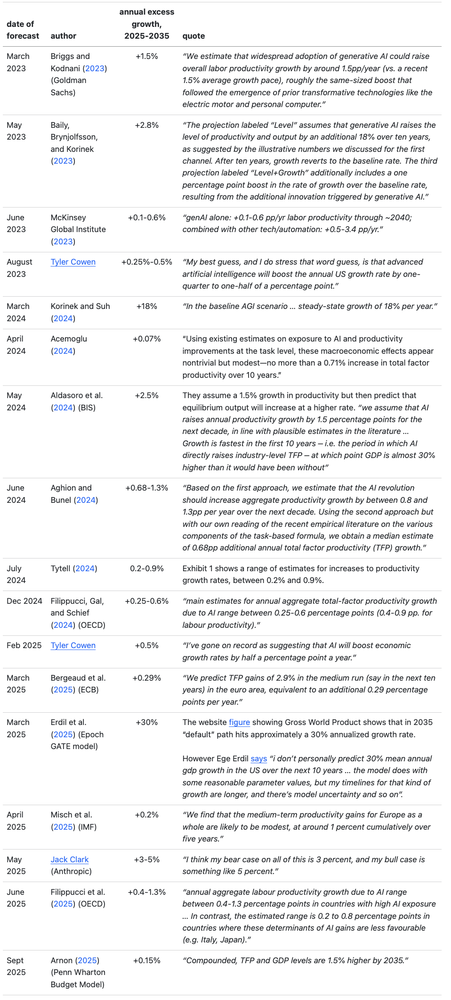


#  Forecasts of AI & Growth, 2025-2035

Most economists' forecasts are 0.1--1.5%/year.

: Notable exceptions @baily2023machines, @korinek2024scenarios.

Most AI insiders' forecasts are 3--30%/year.

: Notable exception: Andrej Karpathy says he expects GDP growth to remain on historical trends.

We can decompose the disagreement into parts:
: 1. Capabilities (share of work automated, Hulten's theorem)
    1. Speed of diffusion.
    2. Degree of complementarity between AI-produced and human-produced goods.

The disagreement is mostly about capabilities growth.
: Economists: fixed capabilities, gradual diffusion.

      AI insiders: growing capabilities, immediate diffusion.

      What we've seen: (1) capabilities doubling every year; (2) diffusion fast, but hard to quantify.


#  How People Use ChatGPT

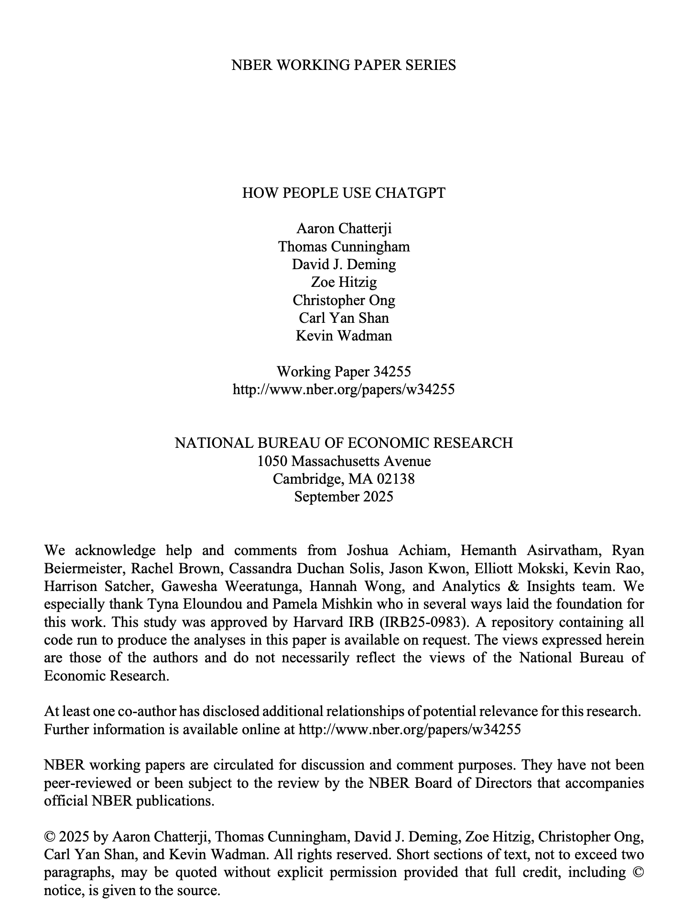

#  How People Use ChatGPT

800M weekly ChatGPT users.
: Growth in both extensive and intensive margins despite substantial increase in competition.

: The volume of queries within-cohort more than doubled over mid-2024 to mid-2025. This is likely causal. Implication: value has doubled.

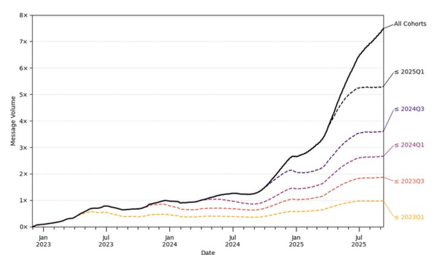

#  How People Use ChatGPT

Around 2/3 of messages are not work-related.
: GenAI's primary impact is *home production*, solving everyday problems. Plausible that it's a substitute for market labor.

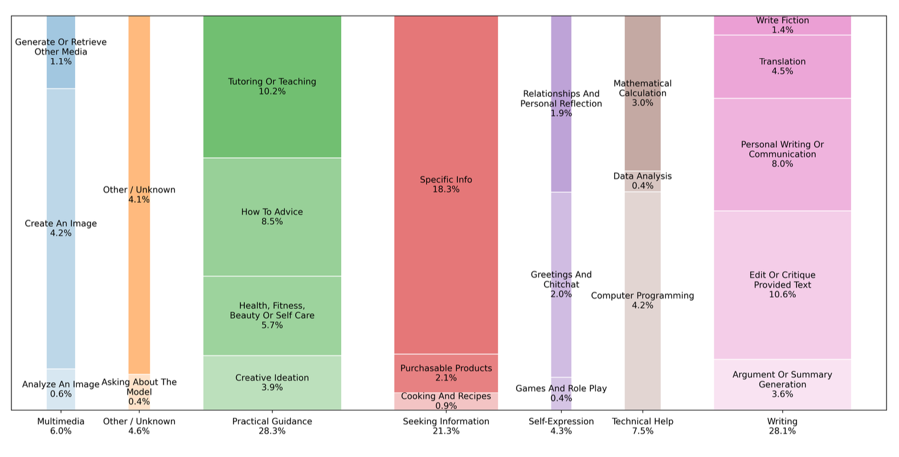


# Stylized Facts about AI Capabilities

Genesis of this work.

: In summer 2024 OpenAI was preparing to launch the first reasoning model (strawberry AKA o1-preview), I was asked to help estimate the likely economic impact.

      The new model showed huge improvements on reasoning-intensive tests (MATH, GPQA), scores comparable to a PhD student.
      
      What will be the impact of a model with PhD-level intelligence?

      Ideal: plug a vector of capabilities into an economic model, & predict the change in equilibrium.

      We don't have such a model.

<!-- There is no standard economic model which I could plug this into to estimate the impact. -->


#  Stylized Facts and Implications

| Fact about AI                                            | Implication for Economics of AI              |
| -------------------------------------------------------- | -------------------------------------------- |
| 1. We have no standard metric for computer intelligence  | Opportunity for theorists.                   |
| 2. LLM capabilities are highly correlated.               | Directed technical change may be difficult.  |
| 3. LLM capabilities are growing rapidly.                 | Diffusion isn't the primary cause of growth. |
| 4. LLM capabilities are distinct from human capabilites. | Need a two-factor model of ability.          |
| 5. There is no consensus on the bottleneck.              | Opportunity for theorists.                   |
| 6. Inference prices are falling at 10X+/year.            | The compute share of GDP may be small.       |
| 7. LLMs can either do a task cheaply or not at all.      | Equilibrium task-sharing seems unlikely.     |


# We have no standard metric for computer intelligence.

**A graveyard of measures of computer intelligence:**

| Measure  | Interpretation                                                                     | Passed Humans |
| -------- | ---------------------------------------------------------------------------------- | ------------- |
| Chess    | Shannon: *"Chess is generally considered to require ‘thinking’ for skilful play."* | 1997          |
| Winograd | *"when people pass the test, we would say they were thinking."*                    | 2019          |
| ARC-AGI  | *"the only formal benchmark of AGI progress."*                                     | 2024          |
| MMMU     | *"Benchmark for Expert AGI."*                                                      | 2025          |
| AGIEval  | *"general abilities ... in tasks pertinent to human cognition"*                    | 2025          |

There are some live proposals, none are canonical.
: Most definitions are either (1) too narrow to generalize, or (2) too vague to measure.

     - @morris2023levels (Google DeepMind) five levels of AGI.
     - OpenAI five levels of AGI, not officially released.
     - @hendrycks2025agidefinition "the definition of AGI."

This is a hard problem!
: It's intellectual quicksand, many smart people have got themselves stuck. Sensible to wear snowshoes.

# Many Taxonomies Proposed, None Widely Adopted

{width=5cm}
{width=5cm}

{width=5cm}
{width=5cm}


# What Metrics of AI Capabilities do we Have?

Two common metrics of AI capability.

:     1. **Scores on benchmarks.** There are hundreds of different benchmarks, but no canonical set, and most get saturated quickly. Continual scramble to create new benchmarks.

      1. **User pairwise preference.** Given two answers to a query, which do you prefer?  These are used by labs to measure user utility, also some 3rd-party data sources, esp. LMsys chatbot arena.

Other metrics of AI capability.

:     1. **Causal effect on user retention.** Used by labs but the results are not generally reported.
      
      1. **Uplift effects on human productivity.** Expensive to collect, (a) very wide range of results; (b) hard to compare over time because subjects and situation constantly changing.
      
      2. **User willingness to pay.** Few studies. Brynjolfsson and Collis report $100/user/month.
      
      3. **Adoption.** 1B+ users, and tens of billions in expenditure, but hard to infer area under demand curve.


# LLM capabilities are growing rapidly

Benchmarks are falling rapidly.

: It typically takes 18 months for LLM scores on a benchmark to go from 25% to 75%.
: {width=5cm}


# LLM capabilities are growing rapidly

Latent ability across benchmarks is growing continuously.

: \ 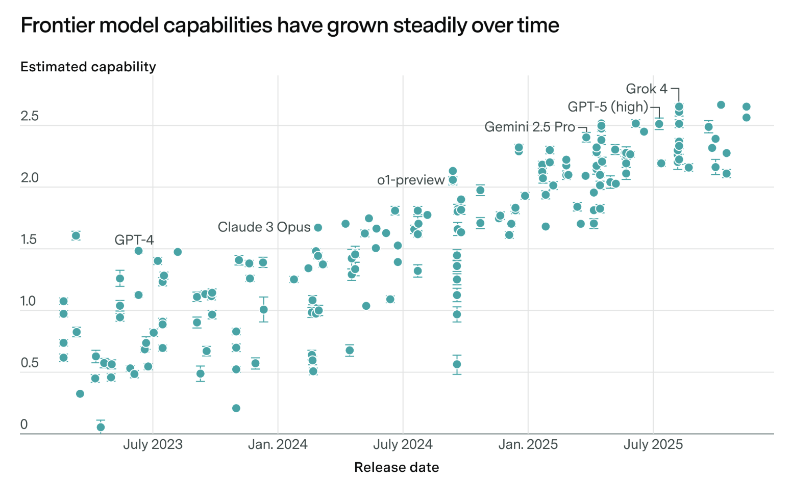
      Latent model ability ("Epoch capability index").

Usage/user doubled over 2024-2025.
: (see above)

# LLM capabilities are growing rapidly

User preference scores are growing rapidly.

: Models have 70% win-rate over 1yo models (150 Elo/year).
: 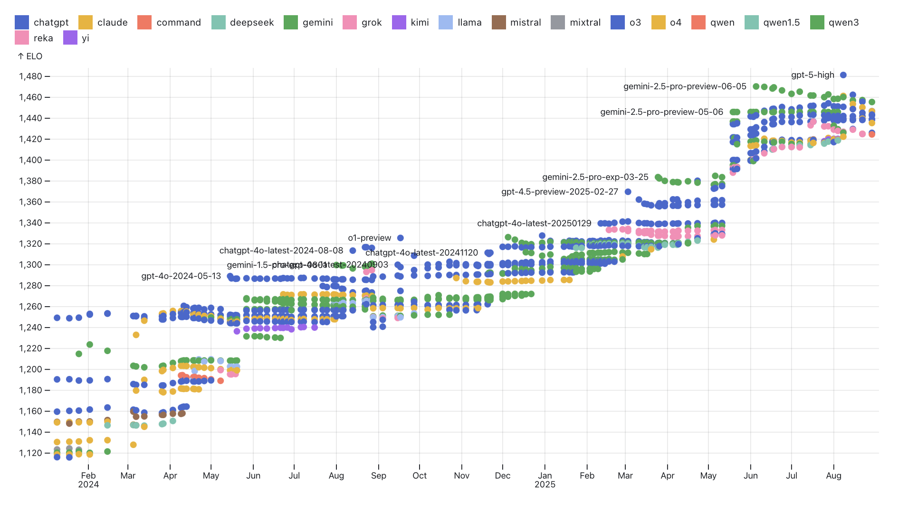{width=7cm}
: 70% is high considering (1) noise; (2) heterogeneous preferences; (3) ceiling effects.

#  Implications of Capability Growth

Economic forecasts should incorporate capabilities growth.

: Argued above.

\vspace{1cm}

There are limits on the usefulness of RCTs.

: Measuring the effect with RCTs is not sufficient.

      1. The causal effects are changing very rapidly.
      2. We expect highly heterogenous effects.
      3. We expect strong effects from experience.


<!-- # Implication for Economic Forecasts

There are many recent forecasts of AI's economic impact.
: Economists typically forecast 0-1.5% range, AI people typically 3-30%+.
   
      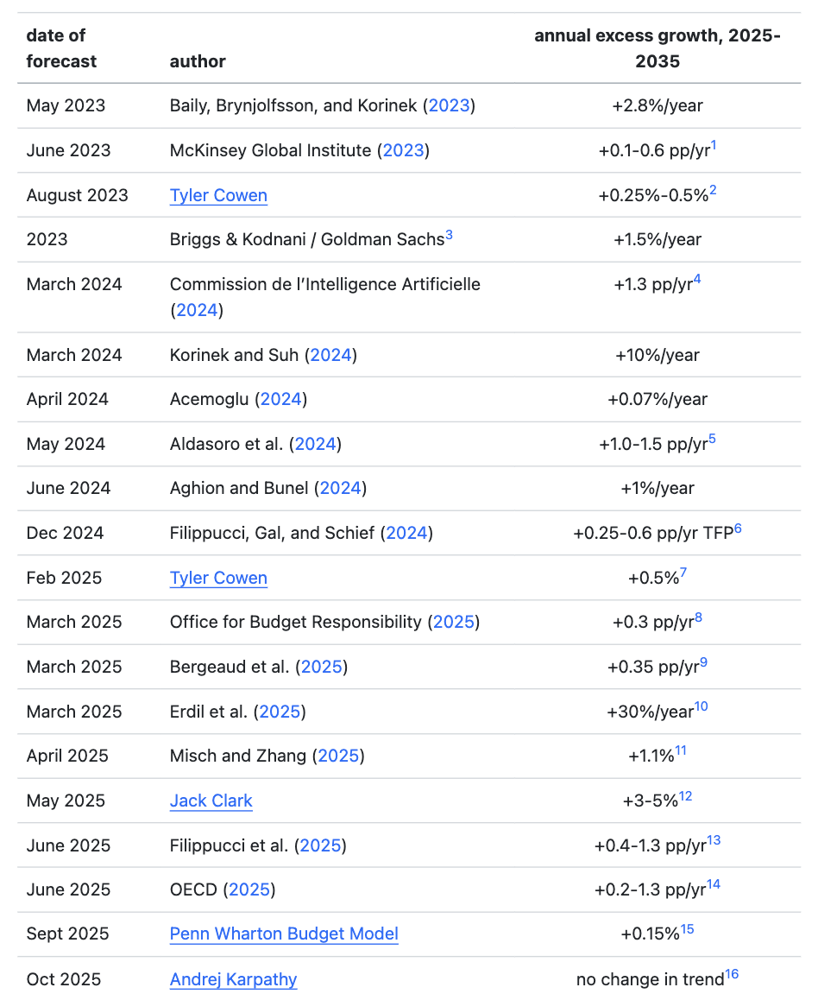{width=5cm}

# Implication for Economic Forecasts

Economists' forecasts typically assume AI is a *one time* event.
: Various assumptions about speedups across tasks (from @trammell2025workflows):
   
      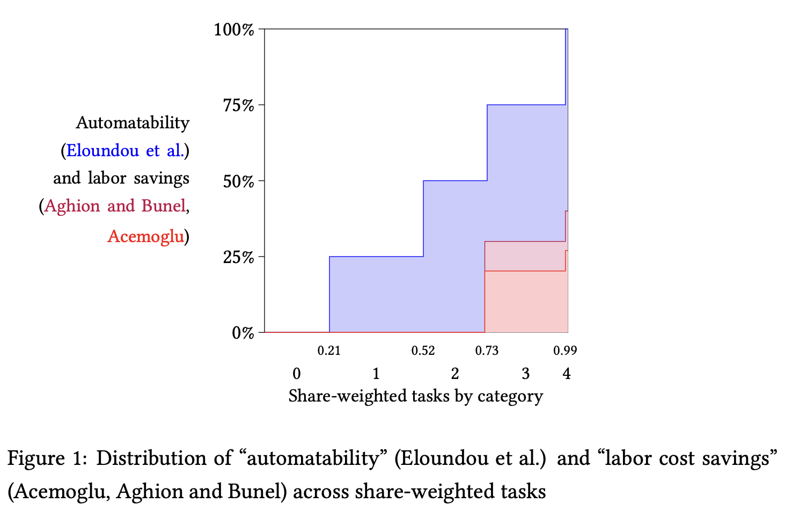{width=7cm}

      @acemoglu2024simple and @aghion2024aigrowth derive growth rates by assuming diffusion speeds.

      But AI capabilities are rapidly increasing -- these areas are expanding. -->

<!-- #  Implication for Economic Forecasts

Much growth is capabilities, not diffusion. 
: Thought experiment: if we had frozen capabilities at gpt-4o (May 2024), how much smaller would the impact be today? 

      Some evidence from AB tests on platforms, which compare engagement with different models.


```{tikz}
\begin{tikzpicture}[scale=4]
  \draw[<->] (1,0)  node[right] {time}--(0,0) -- (0,1);
  \draw[gray!50!white] (.2,1)--(.2,0) node[left,rotate=90,gray] {2023};
  \draw[gray!50!white] (.4,1)--(.4,0) node[left,rotate=90,gray] {2024};
  \draw[gray!50!white] (.6,1)--(.6,0) node[left,rotate=90,gray] {2025};
  \draw[gray!50!white] (.8,1)--(.8,0) node[left,rotate=90,gray] {2026};
  \draw[gray!50!white] (1,1)--(1,0) node[left,rotate=90,gray] {2027};
  \draw[dashed] (0.45,1)--(0.45,0);
  \draw[domain=0.1:.65,smooth,samples=100,blue!25!white,very thick] plot (\x,{0.08*exp(4*\x)});
  \draw[domain=0.1:.45,smooth,samples=100,blue,very thick] plot (\x,{0.08*exp(4*\x)});
  \draw[blue,very thick] (0.45,0.48)--(0.65,0.48)  node[right,align=left] {frozen capabilities};

  \draw[domain=0.1:.65,smooth,samples=100,red!25!white,very thick] plot (\x,{0.03*exp(4*\x)});
  \draw[domain=0.1:.45,smooth,samples=100,red,very thick] plot (\x,{0.03*exp(4*\x)});
  \draw[red,very thick] plot[smooth,tension=1] coordinates{(0.45,0.18) (0.55,0.24) (0.65,0.28)}
      node[right,align=left] {realized value of AI};
\end{tikzpicture}
```
 -->

# LLM Capabilities are Highly Correlated

Many studies find high correlations across scores.

: E.g. @ruan2024observational finds the first factor explains 80% of variance: {width=5cm}

: Additionally:

      1. High correlation between benchmark scores and user-preference rankings (e.g. chatbot arena)
      2. High correlation between benchmark scores and training compute.

# LLM Capabilities are Highly Correlated

What does capability correlation mean concretely?

: The model that is best at math is also probably best at programming, medical advice, legal advice, general knowledge, etc.

      Earlier generations of AI instead showed *specialization*: DeepBlue was good at Chess, Watson was good at Jeopardy.

Supply-side explanation

: Different investments route through the same latent quality:
    $$\begin{aligned}
      q_1&=f_1(g(x_1,x_2))\\q_2&=f_2(g(x_1,x_2))
    \end{aligned}$$
   
    Implicit model of much AI: scaling laws, transfer learning, bitter lesson.

    Interpretation: larger models recover deeper latent structures, & thus are better at everything ("manifold hypothesis", "platonic representation hypothesis").

Demand-side explanations

: Complementarity in demand: people want models that can do everything.

      Hotelling competition: principle of minimum differentiation.

# LLM Capabilities are Highly Correlated

Qualifications
:     1. There is some tradeoff across frontier capabilities, but a frontier model today typically dominates all frontier models from 6 months ago.

      1. There is still a tradeoff between general capability and cost.

      2. Post-training with RL may induce less correlation in abilities.


# Implication: Directing Technical Change may be Hard

Some have proposed building AI to augment human labor.
: @acemoglu2021ai: 
      
      *"our current trajectory automates work to an excessive degree while refusing to invest in human productivity."*
      
      \   
      @brynjolfsson2023turing:

      *"an excessive focus on developing and deploying [human-level AI] can lead us into a trap ... when AI is focused on augmenting humans rather than mimicking them, then humans retain the power to insist on a share of the value created"*

Our ability to direct change may be limited.

: If there is truly a single latent factor of model ability, then work to train an *augmenting* model looks very similar to work to train an *automating* model, & the ability to steer AI capabilities may be limited.


# LLM capabilities are distinct from human capabilities

We sometimes describe AI capability by human equivalent.

:   - years of education (@aschenbrenner2024situational)
    - percentile of human ability (Google, OAI)
    - vertical knowledge (@ide2024artificialintelligenceknowledgeeconomy)

```{tikz}
#| fig-column: center
#| fig-align: center
   \begin{tikzpicture}[scale=4]
      \draw[thick,<->] (1,0) node[right,below]{ability}  -- (0,0);
      \fill[red,opacity=0.5,thick,domain=0:1,samples=100] (0,0)-- plot(\x,{0.3*exp(-((\x-0.5)^2)/(0.2^2))}) -- (1,0) -- cycle;
      \node[red!50!black] at (.5,.4) {humans};

      \fill[green!50!black] (.1,0) circle(0.03);
      \fill[green!50!black] (.2,0) circle(0.03);
      \fill[green!50!black] (.3,0) circle(0.03);
      \fill[green!50!black] (.4,0) circle(0.03);
      \fill[green!50!black] (.5,0) circle(0.03);
      \node[green!50!black,below] at (.6,0) {LLMs};
\end{tikzpicture}
```


A single factor model is a poor fit.

:   LLMs are better than the best human at some tasks.
    
    LLMs are worse than the worst human at other tasks.

Proxies for human ability are bad for LLM ability.

:   LLMs are able to answer almost all exam questions and interview questions for many jobs.
    
    LLMs are not able to do the associated job.


<!-- 

Ideally we would compare human and LLM performance on the same set of tasks.

:  If we had a full matrix of human and LLM performance we would be able to compare latent factors of each. Unfortunately there are few datasets which collect human performance across a range of distinct benchmarks.  -->

# There is a missing factor, we don't know what it is


```{tikz}
#| fig-column: center
#| fig-align: center
   \begin{tikzpicture}[scale=4]
   % Left panel
   \begin{scope}      
      \draw[thick,<->] (1,0) node[right,below]{ability}  -- (0,0);
      \fill[red,opacity=0.5,thick,domain=0:1,samples=100] (0,0)-- plot(\x,{0.3*exp(-((\x-0.5)^2)/(0.2^2))}) -- (1,0) -- cycle;
      \node[red!50!black] at (.5,.4) {humans};

      \fill[green!50!black] (.1,0) circle(0.03);
      \fill[green!50!black] (.2,0) circle(0.03);
      \fill[green!50!black] (.3,0) circle(0.03);
      \fill[green!50!black] (.4,0) circle(0.03);
      \fill[green!50!black] (.5,0) circle(0.03);
      \node[green!50!black,below] at (.6,0) {LLMs};

   \end{scope}
   
   % Right panel
   \begin{scope}[xshift=1.5cm]
      \draw[thick,<->] (1,0) -- node[midway,below]{ability 1} (0,0)
         -- node[midway,rotate=90,above]{ability 2 (bottleneck)} (0,1.1);
      % \fill[green!50!black,opacity=0.5,rotate=65] (.3,-.2) ellipse (0.25 and 0.1);
      \fill[red,opacity=0.5,rotate=10] (.5,.5) ellipse (0.3 and 0.1);
      
      \node[red!50!black] at (.5,.8) {humans};
      % \draw[->,thick,green!50!black] (.26,.1)--(.45,.45);

      \fill[green!50!black] (.1,.1) circle(0.03);
      \fill[green!50!black] (.2,.2) circle(0.03);
      \fill[green!50!black] (.3,.3) circle(0.03);
      \fill[green!50!black] (.4,.4) circle(0.03);
      \node[green!30!black,align=left] at (.6,.3) {LLMs};
   \end{scope}
\end{tikzpicture}
```

<!-- : {width=5cm} -->


# There is no consensus on the bottleneck

Some candidate bottlenecks are already resolved.
: When GPT-4 was released it could perform very well on exams, but the community quickly identified a variety of weaknesses and formalized them. Many of those bottlenecks have been resolved:

| Capability               | Benchmark          | Apr 2023 (GPT-4) |  Dec 2025  |
| ------------------------ | ------------------ | :--------------: | :--------: |
| Deductive reasoning      | MATH               |       23%        |    98%     |
|                          | GPQA               |       36%        |    93%     |
| Information-gathering    | GAIA               |       15%        |    88%     |
| Long context             | Needle-in-Haystack |    50% @ 128K    | 99.7% @ 1M |
| Accuracy / hallucination | SimpleQA Verified  |       ~30%       |    72%     |
| Multimodal inputs        | MMMU-Pro           |       ~35%       |    81%     |
| In-context learning      | ARC-AGI            |        7%        |    88%     |

Once a problem has been well-defined, LLMs have a very strong track record of solving it.

<!-- to add: long context -->

# There is no consensus on the bottleneck

Some candidate bottlenecks at the end of 2025:
: There is no consensus on what is the bottleneck:

\vspace{1cm}

| Bottleneck                  | Status                                 | Benchmark                        |
| --------------------------- | -------------------------------------- | -------------------------------- |
| Cost.                       | Does not seem an important bottleneck. |                                  |
|                             |                                        |                                  |
| Multimodal outputs          | Still struggling                       | GDPVal                           |
| Novel situations            | Mullainathan                           | ARC-AGI-2                        |
| Interactive decision-making | Still bad at playing games             | BALROG, AI village, VendingBench |
| Hard-to-verify rewards      | Karpathy                               | Human-graded rewards             |
| Continual learning          | Amodei, Karpathy, Hasssabis            |                                  |


# Inference prices are falling at 10X/year

Enormous efficiency gains.
: The price of a fixed level of capability has been falling at 10X+/year:

      {width=6cm}

    There is also growth in quality but it's harder to measure (time horizon, latent factor).

Why are prices falling?
: Not because of lower margins -- we see the same trend looking at raw compute cost for open models.

      Smaller models are getting better through (1) better training techniques; (2) more training compute; (3) more training data; (4) better training data.

# LLMs can either do a task cheaply or not at all

Ability to do tasks.
: @metr2024capability say “when agents *can* do a task, they can often do so at a fraction of the cost of humans.” 

      {width=8cm}

Some exceptions to this rule.
: 
      1. Voice transcription for a brief period.
      2. Some reasoning tasks ([ARC-AGI](https://arcprize.org/arc-agi)), briefly.
      3. Fixed costs (@svanberg2024beyond).

# Implication: wages are unlikely to be pinned down by the price of compute

Some models feature equilibrium task-sharing: 
: Humans perform tasks that computers are able to do, but it is too expensive for computers:

      - @trammell2023economic
      - @ide2024artificialintelligenceknowledgeeconomy
      - @smith2024
      - @acemoglu2024simple

Equilibrium task-sharing would require either:

: 1. A dramatic increase in AI prices to perform a task:

       - An increase in the compute required for new tasks (the price of frontier inference has been steady).
       - An increase in compute costs (GPU rental prices have been steady, and the purchase/rent ratio has been stable).
       - An increase in margins.
   
    1. A dramatic drop in human wages.

#  METR Time Horizon

Collect many *computer-using tasks*, and sort them by the time it takes a human to complete (the humans have relevant background but no context).

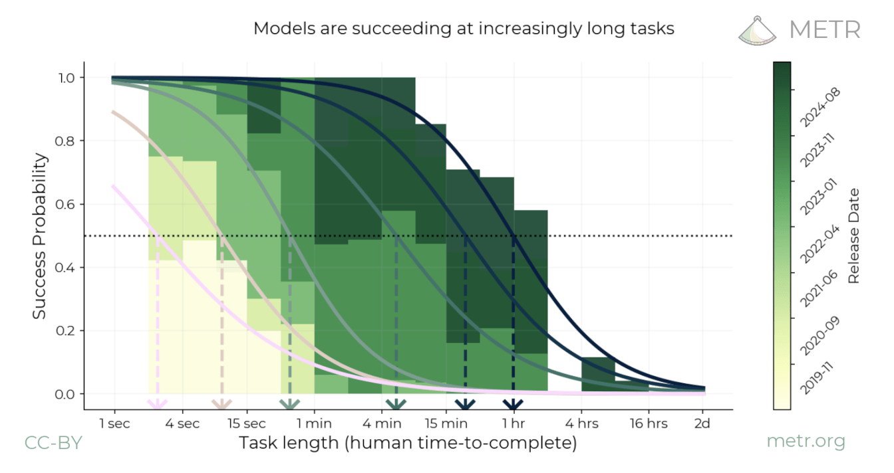

LLMs are consistently better at tasks that take humans less time. Can define a model's ability by its effective time horizon (50th percentile).

#  Time Horizon and Model Ability

Time horizon as a metric of model ability.
: By this metric, we see a relatively smooth growth in time horizon over time.

    One advantage of time horizon: solves the cold start problem. You can predict performance in advance.

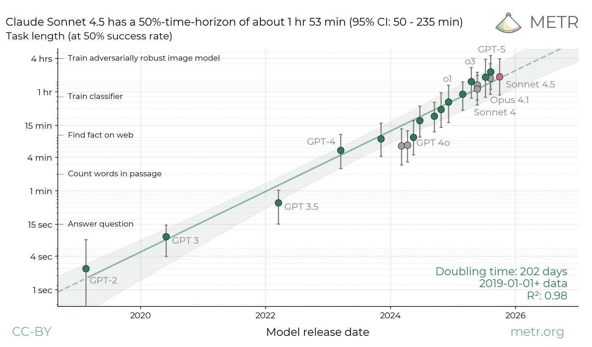

#  Time Horizon Weaknesses

Tasks with long horizons but easy for LLMs.
: E.g. find all the mentions of horses in Anna Karenina.

\vspace{1cm}

Tasks with short horizons but hard for LLMs.
: Tasks with images, physical interaction.

\vspace{1cm}

No definition of how tasks are selected.
: We are running out of long tasks: difficult job of choosing more tasks, but remain faithful to the original distribution.

\vspace{1cm}

No theory of why long tasks are hard for LLMs.
: Long tasks aren't much harder for humans, they just take longer. Long tasks must be different in some way, but unclear why.


# What Would a Satisfying Theory Look Like?


```{tikz}
\usetikzlibrary{positioning}
\begin{tikzpicture}[
  node distance=16mm,
  box/.style={draw, rounded corners, minimum height=8mm, minimum width=18mm, align=center},
  arr/.style={->, thick}
]
\node[box] (world)  {World};
\node[box, right=of world] (humans) {Humans};
\node[box, right=of humans] (data)   {Training Data};
\node[box, right=of data]   (llm)    {LLM};

\draw[arr] (world)  -- (humans);
\draw[arr] (humans) -- (data);
\draw[arr] (data)   -- (llm);
\end{tikzpicture}
```

Some implications:

:     1. LLMs are capped at human abilities.
      1. LLMs are capped at training data.
      2. Chatbots consulted on questions that are *new to you*: doctors use it for legal questions; lawyers use it for medical questions.
      3. Chatbots relatively worse at off-distribution questions.

<!-- ```{tikz}
\begin{tikzpicture}[scale=1]
  \usetikzlibrary{calc}
  \def\R{2.2} % outer radius
  \def\r{1.6} % inner radius (slightly smaller)
  \coordinate (T) at (-1,0);
  \coordinate (U) at ( 1,0);

   % outlines
  \draw[blue!70!black,   thick] (T) circle (\R);
  \draw[orange!80!black, thick] (U) circle (\R);
  \draw[blue!70!black,   thick] (T) circle (\r);
  \draw[orange!80!black, thick] (U) circle (\r);

  % fills (transparency makes overlaps visible)
  \fill[blue!25,   opacity=0.25] (T) circle (\R);
  \fill[orange!25, opacity=0.25] (U) circle (\R);
  \fill[gray] (T) circle (\r);
  \fill[gray] (U) circle (\r);
  %\fill[blue!70,   opacity=0.35] (T) circle (\r);
  %\fill[orange!70, opacity=0.35] (U) circle (\r);

  % labels
  \node[blue!70!black]   at ($(T)+(0,\R+0.35)$) {Tom};
  \node[orange!80!black] at ($(U)+(0,\R+0.35)$) {Ruth};
\end{tikzpicture}
``` -->


# METR is Hiring

Ideal

:     1. Scrappy.
      2. Self-sufficient with software engineering.
      3. Familiar with AI capabilities & evals.
      4. Ideas about using econ/statistics for understanding risks & capabilities.
      5. Experience 

Environment.

:     Pay is competitive with tech salaries (but no equity).

      It feels like the center of the universe.


#  End


#  Model Evaluation and Threat Research (METR)

<!-- More time horizons.
: Sort other datasets of tasks according to human time-horizon: -->

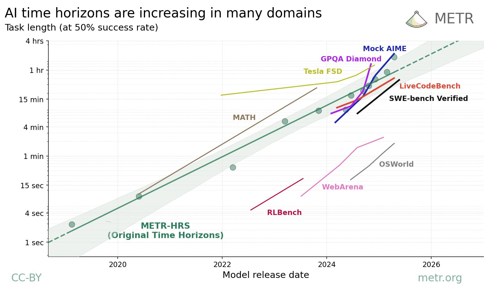


#  METR Uplift Study

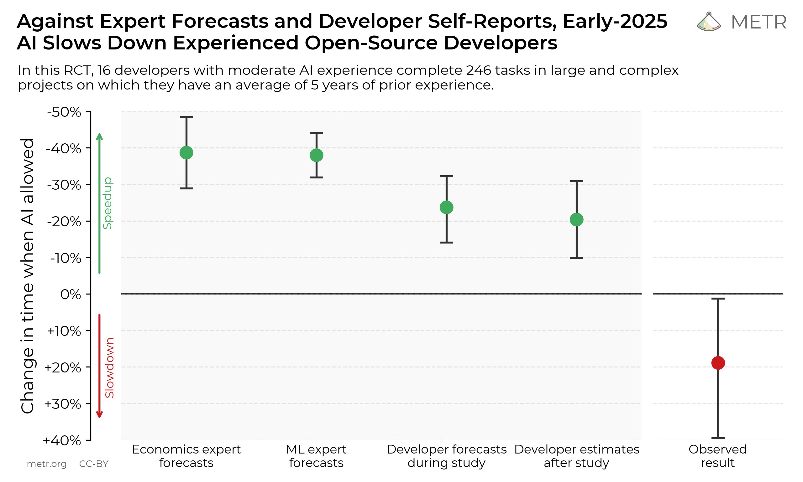

#  Bibliography

