<!-- USEFUL THINGS
- Clone this repo to a local repo (if you open as a remote repo then it's messy)
- Cursor commands: cmd-L to open a chat
- "Quarto: Preview"
- "Paste Image" (might need an extension), use 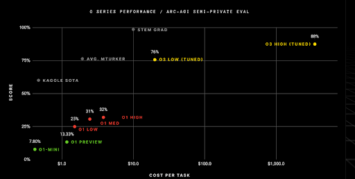{.column-margin}
- Slides @ https://docs.google.com/presentation/d/1_ZgY3nItQ_EjkI9qrrqWj_2oQ1N5dIw1y4wpF-5mcwo/edit?slide=id.p#slide=id.p
-->

<!-- TO ADD:

   - "A Survey on Large Language Model Benchmarks" https://arxiv.org/pdf/2508.15361
   - "Introducing the OECD AI Capability Indicators" https://www.oecd.org/en/publications/2025/06/introducing-the-oecd-ai-capability-indicators_7c0731f0/full-report/component-4.html
   - "Does Reinforcement Learning Really Incentivize Reasoning Capacity in LLMs Beyond the Base Model?" https://arxiv.org/abs/2504.13837

- People to share with for comments:

   - Rishi Bommasani
   - Joel

-->


::: {.column-margin}
   Thanks to many for their suggestions, especially those from the Economic Research team at OpenAI, and Boaz Barak. The document includes significant suggestions from OpenAI staff (Pamela Mishkin, Zoe Hitzig, Gawesha Weeratunga, Ronnie Chatterji), and external academics: Catherine Tucker, David Deming, Erik Brynjolfsson, Anton Korinek, Pascual Restrepo.
:::


#  Overview {#overview}

## We wish to characterize AI capabilities

Our goal is to give a crisp characterization of AI capabilities.

: We wish to answer questions like these:
   
      1. What types of tasks can AI models do / cannot do?
      2. How do abilities differ among different AI models?
      3. How do AI abilities differ from human abilities?
      4. What are reasonable expectations about future AI abilities?

A running theme will be that the characterization of AI capabilities is *difficult*.

:  There is a long history of struggle in making accurate generalizations about the capabilities of artificial intelligence. There is little consensus on how to describe the abilities of contemporary models.

      In this note we list a series of well-documented facts about AI capabilities, and make some more opinionated generalizations. The target audience is economists who are interested in modeling the effects of AI on various situations.

```{tikz}
#| fig-column: margin
\begin{tikzpicture}[scale=0.5]
  \def\nrows{5} % Number of rows -- I tried to dynamically calculate these but it's painful
  \def\ncols{6} % Number of columns 
  \def\blackcells{1/1,1/2,1/3,1/4,1/5,2/2,2/4,2/5,3/3,4/1,3/5} % (format: column/row)
  \def\rowlabels{Basic Algebra Questions,Trivial Pursuit Questions,Pass LSAT,Complete Super Mario Bros,Prove Reimann hypothesis}
  \def\columnlabels{Alice,Bob,Charlie,AI in 2020,AI in 2024,AI in 2028}

   \foreach \i/\j in \blackcells {
      \filldraw[fill=black] (\j - 1,\nrows - \i+1) rectangle ++(1,-1); }
   \foreach \label [count=\i from 1] in \rowlabels {\node[left] at (6,\nrows - \i + 0.5) {?};}
   \foreach \label [count=\i from 1] in \rowlabels {
      \node[left] at (-0.2,\nrows - \i + 0.5) {\label};
   }
   \foreach \label [count=\j from 1] in \columnlabels {
      \node[rotate=90,right] at (\j-0.5,\nrows + 0.2) {\label}; }
   \draw[gray] (0,0) grid (\ncols,\nrows);
\end{tikzpicture}
```

It is useful to think of a matrix of agents and tasks.

: Suppose we can observe whether an agent can perform a task, for a long list of agents and tasks. The agent could be a human, a computer, or a hybrid. We can represent each observation in a matrix with agents and columns and tasks as rows:

We wish to find a low-dimensional factorization of this matrix.

: In practice the matrix is enormous. We can think of the capability problem as finding a low-dimensional representation of this matrix, i.e. some small set of general-purpose capabilities that are highly predictive of whether an agent can do a task.^[We can think of the reduction either as Principal Components Analysis (we take weighted averages of all rows), or Principal Feature Analysis (we take a subset of rows that are highly predictive).]

: A single-dimensional factorization would mean each agent would have a latent ability, and each task would have a latent difficulty. However we will see that a single-factor is often a poor fit, i.e. the relatively difficulty of tasks varies substantially across agents.


## There is no standard measure of machine intelligence


Many proposed measures of AGI have already been satisfied.

:    Scott Alexander [says](https://www.astralcodexten.com/p/sakana-strawberry-and-scary-ai) *“The history of AI is people saying ‘We’ll believe AI is Actually Intelligent when it does X!’ – and then, after AI does X, not believing it’s Actually Intelligent.”*

      Some examples:

      | Measure                                                                                                                                  | Year passed |
      | ---------------------------------------------------------------------------------------------------------------------------------------- | ---------------------- |
      | Chess -- *"Chess is generally considered to require ‘thinking’ for skilful play."* — Shannon, 1950. | 1997|
      | [Winograd Schemas](https://en.wikipedia.org/wiki/Winograd_schema_challenge) - *"when people pass the test, we would say they were thinking."*                                                       | 2019                   |
      | [MMMU](https://mmmu-benchmark.github.io/) – *"Benchmark for Expert AGI."*                                                                | 2025                   |
      | [ARC-AGI](https://github.com/fchollet/ARC-AGI) – *"the only formal benchmark of AGI progress."*                                          | 2024                   |
      | [AGIEval](https://github.com/ruixiangcui/AGIEval) - *"general abilities ... in tasks pertinent to human cognition and problem-solving."* | 2025                   |

      

There are some proposed definitions but none have become canonical:

:    - @legg2007universal proposed "intelligence measures an agent’s ability to achieve goals in a wide range of environments."^[Additionally, @legg2007definitions surveyed 70 different definitions of intelligence as of 2007.]

     - @chollet2019measureintelligence proposed intelligence be defined as "skill-acquisition efficiency", and proposed a formal benchmark (ARC-AGI).

     - @morris2023levels proposed five "levels of AGI", based on the percentile human performance across all tasks. E.g. they classified ChatGPT as being able to do a *"wide range of non-physical tasks, including metacognitive tasks like learning new skills equal to or somewhat better than an unskilled human."*

     - In 2024 OpenAI internally developed a five-level scale of AGI, but it has not been publicly released.[^levels]

     - @hendrycks2025agidefinition proposed an AGI definition based on 10 different sub-dimensions.


[^levels]: https://www.bloomberg.com/news/articles/2024-07-11/openai-sets-levels-to-track-progress-toward-superintelligent-ai


## There is no standard taxonomy of AI capabilities.

There are hundreds of different AI benchmarks of capability.
: These benchmarks are often informally grouped into types which test different types of ability, e.g. "knowledge", "reasoning", "programming", "agentic ability", however there is no generally-accepted taxonomy.

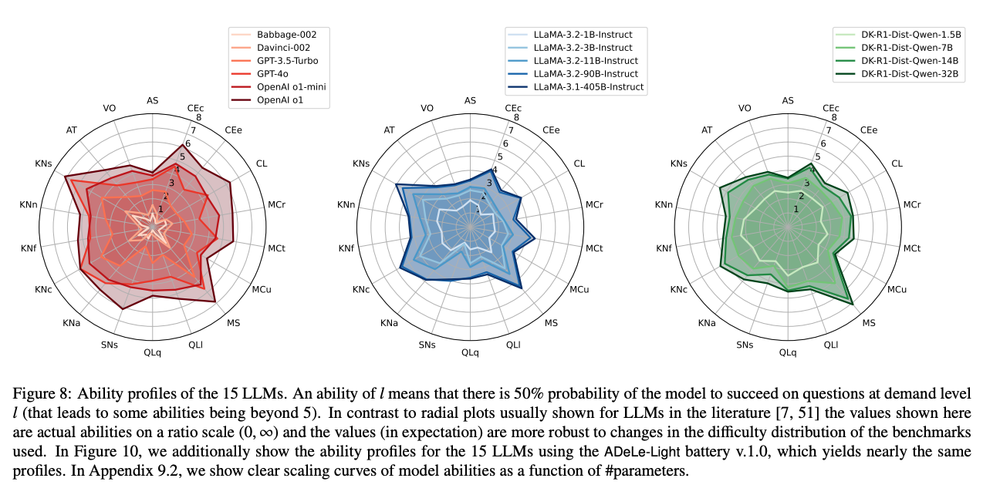{.column-margin}

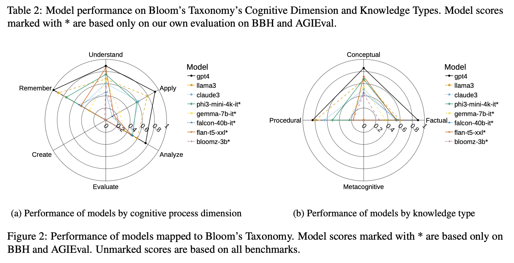{.column-margin}

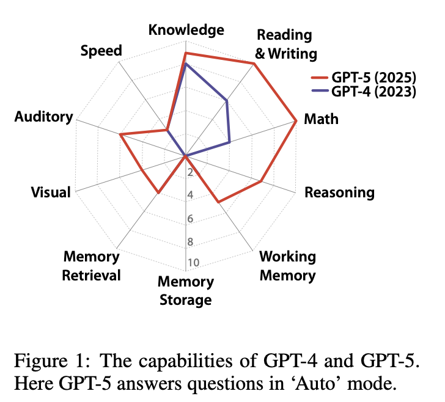{.column-margin}

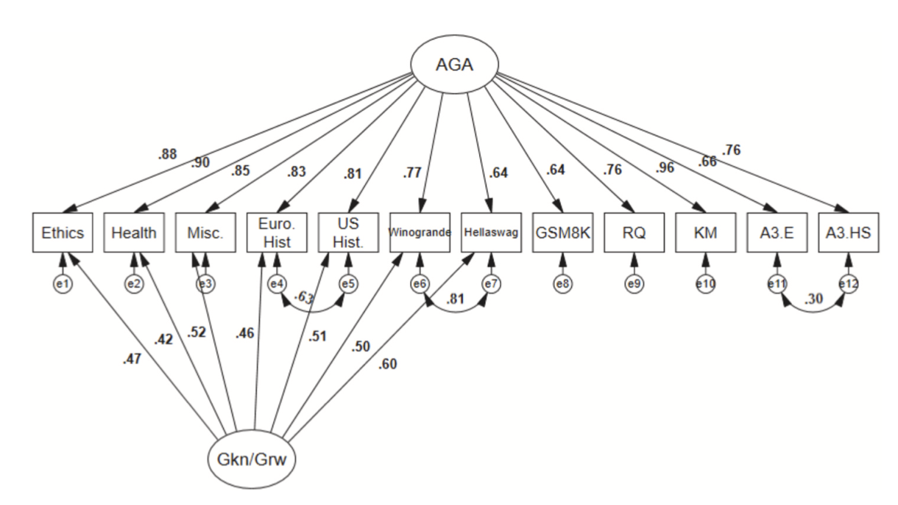{.column-margin}

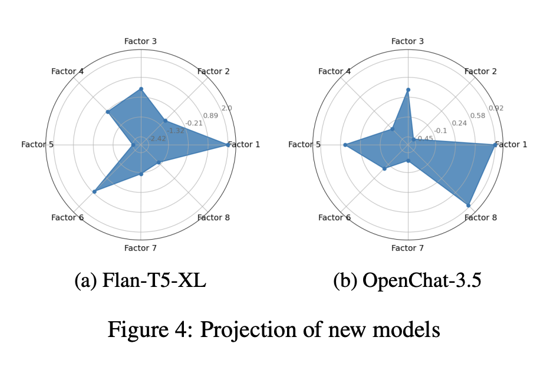{.column-margin}

Some taxonomies of AI capabilities have been proposed but none have been widely adopted.
: @burnell2023reveal look at variation across 29 LLMs and 27 benchmarks (all prior to GPT-4). The first 3 factors explain 33%, 31%, and 17% of performance, and they interpret those factors as "reasoning", "comprehension" and "core language modeling." They say "capabilities are not monolithic. Instead, they are better explained by three well-delineated factors that represent reasoning, comprehension and core language modeling."
: @ilic2024positive tested 591 LLMs on 12 different evaluations, as of March 2024. In their preferred specification the first factor had a loading of 0.81, implying an R^2 of 0.66. They also found that the "number of LLM parameters correlated positively with this general ability."
: @polo2025sloth propose a decomposition with three latent factors: reasoning, knowledge, and instruction-following. However they do not seem to report overall variance explained by each of the factors.
: @maimon2025iq analyze 60 LLMs on 44 tasks, and propose eight latent factors.
: @zhou2025generalscales propose an index of 18 different human-interpretable capabilities (ADeLe). They use an LLM to label 16,000 "task instances" from 20 benchmarks, using rubrics to define each capability. This allows them to predict LLM performance on a task just based on its content, without any prior LLM successes. The scores on each dimension are 1-5, they note that they scores approximately correspond to frequency of achievement among humans, where score $L$ will be achieved by $1/10^{L-1}$ people.^["an item is at level $l$ if l is the highest number such that, in at least 95% of samples of $n = 10^l$ individuals, there is at least one correct."]
response.")
: @oecd2025aicapabilityindicatorsfullreport organize capabilities across nine dimensions. The criteria are mostly qualitative, and their scoring is done by a panel of experts with reference to various benchmark scores. OECD's dimension: Language; Social interaction; Problem solving; Creativity; Metacognition and critical thinking; Knowledge, learning and memory; Vision; Manipulation; Robotic intelligence.
: @huber2025llmsblooms organize benchmark tasks according to "Bloom's Taxonomy", a heirarchical framework designed to classify educational learning objectives for humans, with 6 levels: Remember, Understand, Apply, Analyze, Evaluate, Create. They say there are a lack of benchmarks to measure the two highest levels ("evaluate" and "create").
: @hendrycks2025agidefinition define capabilities along 10 dimensions, based on the Cattell-Horn-Carroll (CHC) theory of cognitive abilities. They give testable evals for only some of these capacities.

Many taxonomies are based on components of between-agent variation.
: Many taxonomies are based on latent factors in variation in performance in a range of tasks.

    Some taxonomies are based on variation among human abilities (e.g. @hendrycks2025agidefinition, @huber2025llmsblooms). Some taxonomies are based on variation across LLM abilities (@burnell2023reveal, @ilic2024positive, @polo2025sloth, @maimon2025iq, @zhou2025generalscales).

    A difficulty with both of these approaches is that they are designed to measure variation *within* one type of agent (LLM or human), not *between* humans and LLMs. There is reason to expect that there exist important human-LLM differences that are orthogonal to within-human or within-LLM variation, e.g. types of tasks where humans show little variation, and LLMs show little variation, but there are large human-LLM differences in ability.^[A similar argument is made by Zachary Tidler et al. [here](https://aievaluation.substack.com/p/is-the-definition-of-agi-a-percentage).]


## There does appears to be a single latent component of intelligence across LLMs

<!-- Historically, the AI capabilities distribution was very varied.

: For most of the history of AI specialized systems were built for different tasks, thus DeepBlue was good at Chess and Watson was good at Jeopardy, but each of them was bad at the other task. -->

LLM abilities are highly correlated across models.

: LLM performance is very highly correlated across benchmarks: if model A beats model B on benchmark X, then it very likely also beats model B on benchmark Y.

      We discuss some literature below which tries to quantify the strength of this correlation.

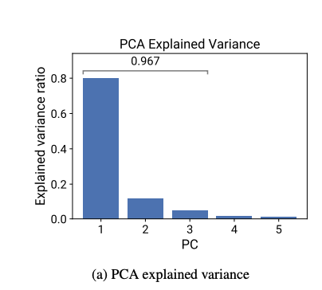{.column-margin}

AI researchers often treat intelligence as a scalar.

: A common sentiment among AI researchers is that it is best to spend time on making a model generally better, rather than fine-tuning for a specific case.

      This sentiment famously named the "bitter lesson" by @sutton2019bitter:

      > “general methods that leverage computation are ultimately the most effective, and by a large margin.”

Much work on "scaling laws" treats model intelligence as a scalar.

: A large part of academic and industry work on AI is spent estimating "scaling laws", i.e. predicting model performance based on various inputs (e.g. training compute, training data size, model scale, and test-time compute). Most work on scaling laws uses a scalar outcome to represent model intelligence, e.g. prediction error on a corpus, or performance on a difficult benchmark. In principle scaling laws could estimate a *vector* of intelligence outputs however this is relatively rare, researchers tend to treat a single scalar as a sufficient proxy for model intelligence.^[polo2025sloth propose a decomposition with three latent factors: reasoning, knowledge, and instruction-following.]

Some theories of the latent component.

: - The Bitter Lesson.
   - The "cognitive core": ([Sean Goedeck](https://www.seangoedecke.com/cognitive-core/#fn-1))
   - The Manifold Hypothesis.
   - The Platonic Representation hypothesis.

<!-- TO ADD: discuss more seriously reasoning models: e.g. o4-mini is frontier at math, but not at general knowledge.  -->

<!-- TO ADD: if there's one latent component, why do labs offer so many models? (1) API customers generally talk about a price-quality frontier; (2) ; -->

<!-- **This is an equilibrium outcome.**  -->

<!-- TO ADD:  discuss whether these correlations hold for *new* benchmarks, introduced after the model is trained -->

<!-- **Related to Moravec’s paradox.** Pinker: “the hard problems are easy and the easy problems are hard.” E.g. arithmetic vs recognizing pictures.
- We should state this carefully, it’s not true ceteris paribus.
- Better: given two tasks of equal difficulty for humans, computers will be better at the one which loads on IQ or book knowledge.
- Much less true now than in the 1980s. -->
\


## Latent LLM intelligence appears to be distinct from latent human intelligence.


```{tikz}
#| fig-column: margin
#| fig-cap: Illustration of LLM vs humans with a single dimension of ability.
   \begin{tikzpicture}[scale=7]
   \draw[thick,->] (0,0)  -- (1,0) node[anchor=north east]{ability};
   \fill[red,opacity=0.5,thick,domain=0:1,samples=100] (0,0)-- plot(\x,{0.3*exp(-((\x-0.5)^2)/(0.2^2))}) -- (1,0) -- cycle;
   \node[red!50!black] at (.5,.4) {humans};

   \fill[green!50!black] (.1,.1) circle(0.03);
   \fill[green!50!black] (.2,.1) circle(0.03);
   \fill[green!50!black] (.3,.1) circle(0.03);
   \fill[green!50!black] (.4,.1) circle(0.03);
   \fill[green!50!black] (.5,.1) circle(0.03);
   \node[green!50!black,below] at (.1,.3) {LLMs};
\end{tikzpicture}
```


```{tikz}
#| fig-column: margin
#| fig-cap: Illustration of LLM vs humans with two dimensions of ability.
   \begin{tikzpicture}[scale=7]
      \draw[thick,<->] (1,0) -- node[midway,below]{ability 1} (0,0)
         -- node[midway,rotate=90,above]{ability 2} (0,1.1);
      % \fill[green!50!black,opacity=0.5,rotate=65] (.3,-.2) ellipse (0.25 and 0.1);
      \fill[red,opacity=0.5,rotate=10] (.5,.5) ellipse (0.3 and 0.1);
      
      \node[red!50!black] at (.5,.8) {humans};
      % \draw[->,thick,green!50!black] (.26,.1)--(.45,.45);

      \fill[green!50!black] (.1,.1) circle(0.03);
      \fill[green!50!black] (.2,.2) circle(0.03);
      \fill[green!50!black] (.3,.3) circle(0.03);
      \fill[green!50!black] (.4,.4) circle(0.03);
      \node[green!30!black,align=left] at (.6,.3) {LLMs};
\end{tikzpicture}
```


<!-- ```{tikz}
#| fig-column: margin
   \begin{tikzpicture}[scale=4]
   \draw[<->] (1,0) -- node[midway,below]{ability 1} (0,0)
      -- node[midway,rotate=90,above]{ability 2} (0,1.1);
   \fill[green!50!black,opacity=0.5,rotate=65] (.3,-.2) ellipse (0.25 and 0.1);
   \fill[red,opacity=0.5,rotate=10] (.5,.5) ellipse (0.3 and 0.1);
   \node[green!50!black,align=left] at (.6,.3) {LLMs};
   \node[red!50!black] at (.5,.8) {humans};
   \draw[->,thick,green!50!black] (.26,.1)--(.45,.45);
   %\fill[black!20!white] (0.5,0.5) ellipse (0.4 and 0.3);
   \end{tikzpicture}
``` -->

Humans have a fairly positive correlation among abilities.

:  There is a reasonable correlation among different measures of general ability (IQ, g-factor).

    There is a reasonable correlation between years of education, IQ, standardized tests score, and wage.

Ideally we would compare human and LLM performance on the same tasks.

: If we had a full matrix of human and LLM performance we would be able to compare latent factors of each. Unfortunately there are few datasets which collect human performance across a range of distinct benchmarks. 

We can compare the average human with the average LLM.

: Many benchmarks do report performance for the average or expert human, so we can make those comparisons. Additionally we can run LLMs on many human standardized tests and exams.

Latent factors for human and LLM ability appear to be significantly different.

: Aptitude tests that are predictive for humans are not predictive for LLMs. GPT-4 was able to get human-level scores at most aptitude tests: SAT, LSAT, civil service. But GPT-4 did not have the aptitudes passing such tests implies for humans.

     LLMs are able to do tasks no human can: LLMs can translate between pairs of languages which no human knows (Aymara to Kazakh), can combine knowledge from two very different domains.

## There is *some* bottleneck on LLM abilities, but disagreement about where

In 2023 many people thought GPT-4 could do a significant fraction of work:

:     - @eloundou2023gpts estimated that GPT-4 would halve the time required to perform a task for between 14% and 56% of all tasks in the economy.

      - @chui2023economic (McKinsey) claimed *"the total percentage of hours that could theoretically be automated by integrating technologies that exist today ... [is] 60–70 percent."*

      In retrospect these estimates seem to have been overly optimistic. There is some missing capability in GPT-4 level ability.

AI researchers are not sure what is the bottleneck.

:     [Andrej Karpathy](https://x.com/karpathy/status/1855659091877937385), Nov 2024:

      > "Even though by many accounts (evals), LLMs are inching well into top expert territory (e.g. in math and coding etc.), you wouldn't hire them over a person for the most menial jobs. It's an interesting challenge how we can create evals for all the "easy" stuff that is secretly hard. Very long context windows, coherence, autonomy, common sense, multimodal I/O that works, ... How do we build good "menial job" evals?"* 

      [Shunyu Yao](https://ysymyth.github.io/The-Second-Half/), April 2025: 

      > “AI has beat world champions at chess and Go, surpassed most humans on SAT and bar exams, and reached gold medal level on IOI and IMO. But the world hasn’t changed much, at least judged by economics and GDP. I call this the utility problem, and deem it the most important problem for AI.”* 

## There are many candidates for the bottleneck

Here we list a variety of abilities that LLMs lack, which might explain the bottleneck to adoption. To make the bottleneck question concrete: LLMs can pass many tests used to test for human aptitudes (SAT, LSAT, civil service exams), and many interview questions, yet LLMs clearly lack the aptitude to perform the associated jobs. Thus there must be some other missing skill.

| Capability               | Benchmark                    | Apr 2023 (GPT-4) | Dec 2025  | Human  |
| ------------------------ | ---------------------------- | :--------------: | :-------: | :----: |
| Deductive reasoning      | MATH[^MATH]                  |       23%        |    98%    |        |
|                          | GPQA[^GPQA]                  |       36%        |    93%    |        |
| Information-gathering    | GAIA[^GAIA]                  |       15%        |    88%    |        |
| Accuracy / Hallucination | SimpleQA Verified[^SimpleQA] |       ~30%       |    72%    |        |
| Long context             | Needle[^needle]              |    50% @ 128K    | 99.7% @ 1M |        |
| Multimodal inputs        | MMMU-Pro [^MMMU]             |       ~35%       |    81%    |  85%   |
| In-context learning      | ARC-AGI[^ARCAGI]             |        7%        |    88%    | 77-98% |
|                          | ARC-AGI 2[^ARCAGI]           |       ~0%        |    45%    |  98%   |


[^needle]: https://cloud.google.com/blog/products/ai-machine-learning/the-needle-in-the-haystack-test-and-how-gemini-pro-solves-it
[^MATH]:
[^GPQA]:
[^MRCR]: MRCR v2 (8-needle), 128k: https://deepmind.google/models/gemini/pro/
[^SimpleQA]: https://arxiv.org/pdf/2509.07968v1 and https://blog.google/products/gemini/gemini-3/#gemini-3
[^MMMU]: https://mmmu-benchmark.github.io/#leaderboard and https://blog.google/products/gemini/gemini-3/#gemini-3
[^ARCAGI]: https://arcprize.org/leaderboard


| Bottleneck                   | Benchmarks                       | Benchmarks  |
| ---------------------------- | -------------------------------- | ----------- |
| Continual learning.          | Amodei, Karpathy, Hasssabis.     |             |
| Novel situations             | RL generalization, world models. |             |
| Interactive decision-making. |                                  | BALROG, 44% |
|                              |                                  |             |


[^Balrog]: 


Data density.
: @vonwerra2025jaggeddata argues that jaggedness is mainly due to availability of data.

Accuracy.
: LLMs have often made confident false claims ("hallucinations"), and this has clearly been a barrier to their adoption. This behavior is not penalized in classic benchmarks which score only right and wrong answers, and so the LLM has an incentive to guess. Similarly user pairwise preference does not penalize hallucinations when the user is not immediately aware of the accuracy of claims.
: Benchmarks can test for accuracy in a variety of ways: (1) score based on confidence; (2) elicit open-ended responses, with a penalty based on claims that are false or misleading.

Deductive reasoning.
: Many questions involving reasoning are drawn from a fairly stylized pool, and LLMs historically performed poorly on questions that are novel, or have misleading associations ("Alice in Wonderland"). Since the launch of reasoning models in late 2024 LLMs have become far better at deductive problems.  <!-- compositionality -->

Novel situations.
: LLMs sometimes fail on problems that are very dissimilar to their training data ("out of distribution"). Because LLMs are trained on enormous amounts of data their skills could reflect memorization or interpolation rather than general intelligence.

      @vafa2024worldmodel argue that Transformer-based LLMs can generalize well along some axes but badly along others. They say "such incoherence creates fragility: using a generative model to solve related but subtly different tasks can lead to failures." They propose tests of world model coherence.

High context.
: Questions on aptitude tests have short prompts, while real-world problems involve rich context.

Continual learning.
: Typically LLMs have been used in a *stateless* manner, where the model weights are fixed and only the prompt changes. This means that any learning about the environment must happen with a separate system, or by through recursive updates to the prompt. This has been cited by many people as a critical bottleneck: Karpathy, Hassabis, Altman, Amodei.

    [Hassabis, August 2025](https://aipositive.substack.com/p/decoding-deepminds-vision-an-analysis)

    [Dwarkesh Patel, July 2025](https://www.dwarkesh.com/p/timelines-june-2025):

    > "the fundamental problem is that LLMs don’t get better over time the way a human would. The lack of continual learning is a huge huge problem."

    Dario Amodei, August 2025:
   
    > "Models learn within the context ... Maybe we'll train the model in such a way that it is specialized for learning over the context. You could, even during the context, update the model's weights ... So, there are lots of ideas that are very close to the ideas we have now that could perhaps do [continual learning].”

    [Noam Brown, Nov 2025](https://x.com/polynoamial/status/1994439121243169176):

    > "More research breakthroughs are probably needed to achieve AGI/ASI. (Continual learning and sample efficiency are two examples that researchers commonly point to.)"

   [Shane Legg](https://www.youtube.com/watch?v=l3u_FAv33G0&t=3s):

   > "So there are all sorts of things like this [continual learning and visual reasoning], that we currently see. I don't think there are fundamental blockers on any of these things. ... So my expectation is over a number of years these things will all get addressed. But they're not there yet.""

   

Planning / long-horizon decision-making.
: @dorn2025temporal argue that current LLMs are poor at "sequential coherence", they estimate the time-length of ONET tasks as a proxy for sequential coherence required.

In-context learning.

: @chollet2019measureintelligence argues that most benchmarks test for *existing* skills instead of requiring the agent to learn *new* skills, which is distinctive for human intelligence. He introduced the Abstraction and Reasoning Corpus (ARC) task to test for the ability to do skill acquisition (also sometimes called in-context learning).
: LLMs made significant progress on the ARC benchmark, approaching human levels in 2024. However a new version was introduced (ARC-AGI-2), which is again relatively straight-forward for a human but difficult for an LLM.

Multimodal inputs and outputs.

: LLMs primarily operate on text inputs and outputs.

Interactive decision-making.
: Questions on aptitude tests do not require a series of decisions, navigating an uncertain situation.
<!-- Kaggle GameArena -->

Predictability.
: Some people have claimed a bottleneck is the *unpredictability* of LLM abilities. This can be interpreted in two ways: (1) humans have systematically biased beliefs about LLM abilities; (2)  i.e. even if LLM accuracy might be high over a broad class of questions, the accuracy varies across subclasses. @vafa2024humangeneralization say "when the cost of mistakes is high, more capable models can perform worse on the instances people choose to use them for because they are not aligned with the human generalization function."

      A related point is that LLMs can be inconsistent, giving qualitatively different answers to a question when the wording is slightly different.

Cost.
: (...)

I have not added separate category for "reliability," meaning lack of randomness, because it is relatively to run an LLM in a mostly deterministic fashion, and so eliminate concerns about randomness.

Other discussions of bottlenecks:

- @toner2025takingjaggedness discusses reasons for jaggedness: (1) easier vs harder to verify tasks; (2) can you put the context in the context window; (3) level of adversarialness; (4) cognitive vs physical.
- @heitmann2025trajectories 
   - Performance on tasks that are hard to verify 
   - Performance on long tasks (that take human workers a long time)
   - Performance in complex environments
   - Sufficiently low error rate
   - Meta-awareness and calibration
   - Adaptability to the deployment environment
   - Continual learning post-deployment
   - Original insights

##          There are few forecasts of future capabilities

- Manifold markets https://manifold.markets/SG/eci-2026-epoch-capabilities-index-h

# LLM Performance on Tasks

In this section we discuss performance on tasks that have a measurable output.

## The time between benchmark introduction and saturation has been decreasing

If we had a cardinal scale of computer intelligence we could talk about the rate of improvement in a precise way. The best proxy for velocity is the history of AI benchmarks: new benchmarks are introduced when computers achieve human-level performance on the old benchmarks (“saturation”).

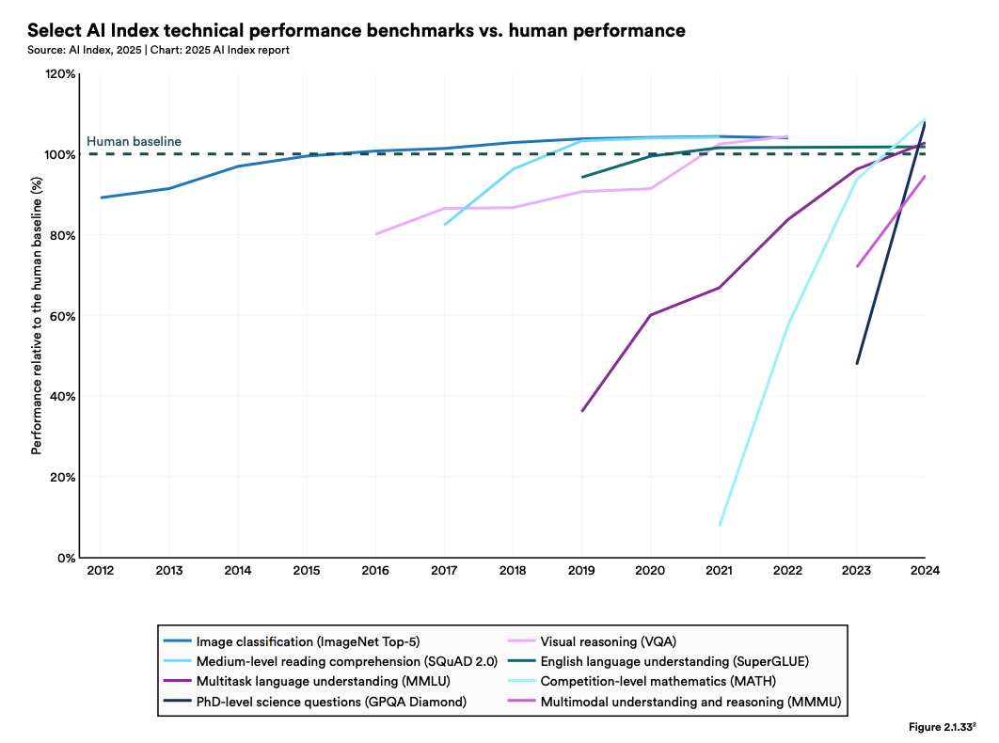{.column-margin}
Since 2012 the rate of benchmark saturation seems to be increasing:

<!-- TODO: is there a better graph from Epoch's data -->

<!-- Good sources of benchmark data:
- [EPOCH AI benchmarking hub](https://epoch.ai/data/ai-benchmarking-dashboard#explore-the-data). 
- [Stanford AI Index](https://aiindex.stanford.edu/report/) (2025) tracks 8 benchmarks over time, visual and language. 
- Kiela/Dynabench/Contextual.ai (2023) [“Plotting Progress in AI”](https://contextual.ai/blog/plotting-progress-in-ai/). The data is not shared publicly. 
- [Killed by LLM](https://r0bk.github.io/killedbyllm/), Robert Kopel ([discussion](https://news.ycombinator.com/item?id=42606231), [data](https://github.com/R0bk/killedbyllm/blob/main/src/data.ts))
- [PapersWithCode](https://paperswithcode.com/sota).
 -->

## LLM performance is highly correlated across benchmarks

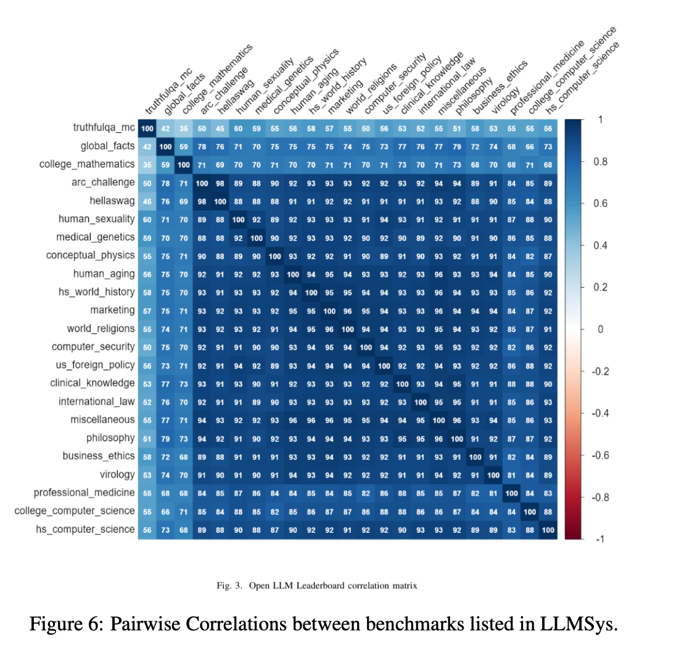{.column-margin}

{.column-margin}

Frontier models that surpass previous models on one benchmark usually outperform them on most other benchmarks.

: @spangher2024generalized construct an aggregatation across benchmark scores (MPG = Model Performance and Goodness), which they find is highly correlated with Elo rating on LMArena. The strongest model in their dataset is `o1-preview`.

: @ruan2024observational create "observational scaling laws" from the performance of 77 LLMs (as of May 2024) on 8 benchmarks. They find the first component explains 80% of the variation, also that training compute is highly predictive of this factor (for open models, which have known scale). They also fit scaling laws for the effect of inference-time techniques such as Chain-of-Thought and Self-Consistency.

: @kipnis2025metabench find a small set of questions which are highly predictive of overall model scores, and that "a single underlying common factor whose Spearman correlation with the total score is r= 0.93."

: @zhang2025trainbeforetest find that differences in model abilities across benchmarks decline substantially when the models are given a small fine-tuning on the specific benchmark (train-before-test).

    > "train-before-test reduces the model-score matrix to essentially rank one, indicating that model potential is dominated by one latent factor, uncovered by train-before-test."

    They also find that the latent factor is very highly correlated with pretraining perplexity.^[Train-before-test also raises rank agreement between benchmarks: "On average, the overall average Kendall’s τ is 0.52 for direct evaluation and 0.76 for train-before-test."]

## The best predictor of benchmark performance is training compute.

There is a well-known literature on "scaling laws" finding that pretraining loss (i.e. error in predicting the next token) is a predictable function of the training parameters.

- @kaplan2020scalinglaws predict LLM performance in next-token prediction error, as a function of model size, dataset size, and training compute. They find scaling laws that are reliable across 7 orders of magnitude. Their equations implied that model size was the most important parameter (not dataset size).^["Larger models are significantly more sample-efficient, such that optimally compute-efficient training involves training very large models on a relatively modest amount of data and stopping significantly before convergence."]

- @hoffmann2022computeoptimal revisit scaling laws with more data and a different functional form:
   $$\ut{\hat{L}}{loss}(\ut{N}{parameters},\ut{D}{data}) \simeq \utt{E}{irreducible}{loss} + aN^{-.3} + bD^{-.3}$$

   Their fit finds that training data and model size should optimaly scale at the same rate. Their model predicted that it would be optimal to train a model with much smaller size and larger amount of data, compared to existing models. They trained such a model ("chinchilla") and indeed found that it significantly outperformed other models with the same compute inputs.

- @choshen2024hitchhiker surveys scaling-law best-practices in 2025, and largely confirms the functional-form and parameters proposed in @hoffmann2022computeoptimal.

The classical "scaling laws" literature predicts the fit on training loss, meaning next-token prediction error.  There is a smaller literature which predicts performance on task benchmarks (note that these are usually from a model with post-training):

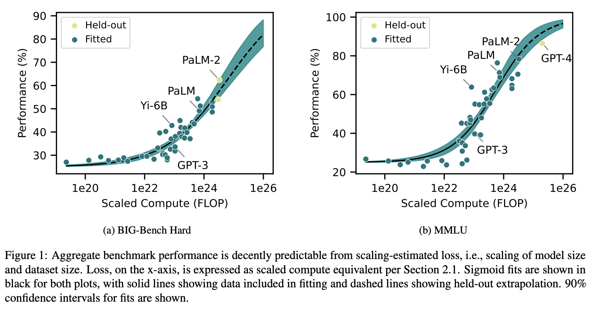

- @owen2024predictable find that model scale is highly predictive of benchmark performance, and the relationship remains relatively stable across five orders of magnitude.^["when extrapolating BIG-Bench Hard performance across one order of magnitude in compute, we observe average absolute errors of 6 percentage points."] The strongest model in their dataset is GPT-4. This paper also discusses a number of previous contributions on benchmark scaling.

- @ruan2024observational find tight relationships between training compute, simple capability measures, and complex downstream metrics.


## The effective scale of frontier models has been growing at around 15X per year.

The effective scale of frontier models takes into account both the increase in training compute used as well as the algorthmic efficiency in utilizing each unit of compute.

- [Epoch AI](https://epochai.org/trends) (Jan 2025) estimate that over 2015-2025:
  1. Training compute on frontier LLMs has increased around 5X per year; 
  2. Algorithmic efficiency increased around 3X per year. 
  - Combined, these imply that the “effective” compute used on frontier models is growing at around 15X per year.

## Benchmark performance significantly improves with test-time scaling on some tasks.

Test-time scaling (AKA inference-time compute) can be achieved in two ways:

   1. Aggregating multiple models calls (self-consistency AKA majority vote @wang2023selfconsistency, tree-of-thought, etc.)
   2. Training a model with a variable budget of inference-time tokens ("reasoning" models).

The returns to inference-time compute seem to vary by the nature of the problem.

Test-time scaling is not a perfect substitute for model scale: @wu2025inferencescaling shows that small models with inference-time compute have performance that asymptotes below those of large models.

- @beeching2024scalingtesttimecompute find that traditional test-time scaling (majority vote, best-of-N, beam search) shows sub-log-linear returns on a math problems benchmark.
- @epoch2025howfarcanreasoningmodelsscale (Epoch) say that existing evidence from OpenAI and DeepSeek shows log-linear relationships between test-time compute and performance on benchmarks, and say "this suggests that performance scales with reasoning training in a way similar to pre-training, at least for math and coding tasks."
- @balachandran2025inference compare inference-time compute across a variety of tasks and say *"Although inference-time scaling improves performance, its effectiveness varies between domains and tasks, with diminishing returns as task complexity increases."*

## Benchmark tasks that are harder for humans are typically harder for LLMs.

There is typically a positive correlation betwen the tasks that humans find more difficult and ones LLMs struggle with the most. 

- @zhou2024reliable find a positive correlation between human difficulty and AI difficulty.
- @dreyfuss2025human find no correlation between human and AI success rate across a set of math questions, however note that the results are using GPT-3.5.


## LLM performance degrades significantly with context length.

As of July 2025, frontier models have an effective context length (where performance is >85% of a short-context task) of around ~16,000 words in the [NoLiMa Benchmark](https://github.com/adobe-research/NoLiMa). 

- LongBench (@bai2024longbench) is a benchmark for long-context understanding, found that the best models as of Sep 2024 (o1-preview) outperformed human baseliners given 15 minutes by 15% on short tasks (<32k context), this dropped to only a 5% gain for long-context tasks (>128k).


## LLM performance on benchmarks is highly variable within the same task.

LLMs have stochastic outputs and they often have varying success rates when the same task is repeated. As a consequence an LLM’s average score on a benchmark can be very different from their best-of-n and worst-of-n scores (note that if output was deterministic then all three scores would be identical). 

- @renze2024effect find "changes in temperature from 0.0 to 1.0 do not have a statistically significant impact on LLM performance for problem-solving tasks"

- @song2024good say "we observe that greedy decoding [temperature=0] generally outperforms sampling methods [temperature>0] for most evaluated tasks."


## LLM Performance on related sub-tasks is highly variable.

LLMs generally have much smaller correlations in their ability to successfully complete similar tasks than humans. 

- @dreyfuss2025human find that, for a given aggregate SAT score, humans have much larger variations across subjects than LLMs.

<!-- - O*Net data suggests that most current jobs contain bundles of tasks that humans have strong positive correlations over their ability to complete. Given LLMs have much weaker correlations, it suggests that if this trend continues over time they will have to far exceed human performance on individual subtasks before being able to match selected human performance on overall jobs.  -->


## LLM performance is sensitive to prompt wording.

The performance of LLMs on certain benchmarks can vary signficantly depending on the prompting given to the model.

- @mirzadeh2024gsm find that adding irrelevant instructions to a prompt significantly lowers performance on grade-school level questions. However [Andrew Mayne (2024)](https://andrewmayne.com/2024/10/18/can-you-dramatically-improve-results-on-the-latest-large-language-model-reasoning-benchmark-with-a-simple-prompt/) shows that this performance penalty disappears when the prompt included a warning (“*this might be a trick question designed to confuse LLMs with additional information.”*).

-  @valmeekam2024llms finds that translating an ordinary problem into an artificial language significantly lowers performance on planning problems (e.g. “mystery blocksworld” in PlanBench). However o1-preview was still able to perform at 50%.

- @li2025perturbation find that performance on math problems degrades somewhat when reworded. The declines are particularly severe for small open-source models.


## Benchmark tasks that take humans longer are typically harder for LLMs.

There is a very strong negative correlation between how long it takes for a human to complete a task (in logarithmic terms) and the probability that an LLM will be able to complete it successfully.

- @kwa2025longtasks find that the longest length of task that a frontier LLM has been able to complete with greater than 50% probability has been doubling every seven months over the last six years across a range of software engineering, cybersecurity, and general reasoning tasks. As of June 2025 it stands at just under two hours. A July 2025 update from METR shows that the time horizon is similar across other benchmarks testing quantitative and analytical skills and whilst there are larger differences in other domains (eg. web-browsing tasks) the rate of change over time is similar. The relationship between model success probability and the length of time it takes a human to complete a task is well fit with a logistic curve.  The correlation in the errors of different models is high (79% between claude 3.7 and o1) even after accounting for task length and average model performance suggesting there are features of tasks beyond task length with predictive power for model performance. 
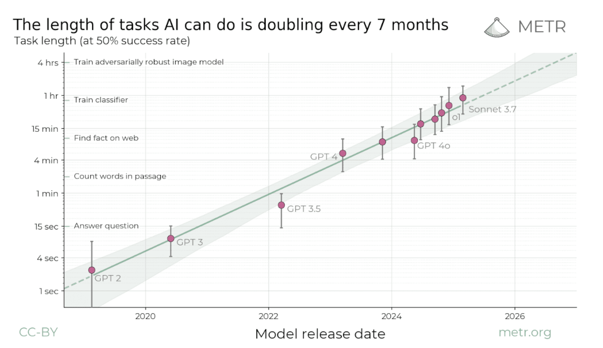{.column-margin}

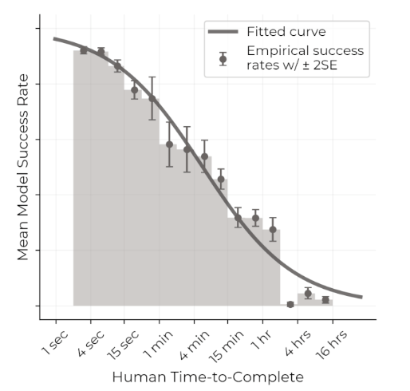{.column-margin}

-  @ord2025halflife argues that LLMs performance degradation over time is roughly consistent with a hypothesis that long tasks are random combinations of subtasks, each with a constant half-life of success.

## LLMs perform particularly well on math and programming competition problems.  

- Frontier LLMs can outperform the vast majority of competitors in math competitions (eg. [AIME](https://www.vals.ai/benchmarks/aime-2025-03-11), [MATH](https://arxiv.org/pdf/2103.03874)). In a prominent programming competition, [ Codeforces](https://arxiv.org/pdf/2501.01257v2), o3's performance would place it as the 175th ranked competitive programmer in the world.

<!-- ## LLMs do very well on exam questions, especially when the answer is short.

Frontier LLMs have very high accuracy on typical exam questions up to the PhD and professional level: 

- SAT – 89% vs human average of 66%. 
- LSAT – 87% vs human average of 56%. 
- GMAT/GRE – 87% vs human average of 85%. 
- OpenAI software engineering job interview questions: 92%. 

However it is notable that most benchmarks rely on *short answer* questions, i.e. they are not evaluated on essays or research papers. Short answer questions are popular in part because they can be automatically graded by a computer, whereas long answers typically require human grading, and so there is far less data available.   -->

## LLMs show some ability to autonomously complete software engineering tasks.

- Frontier models can autonomously resolve 75% of a set of curated issues in software systems on github ([SWE-bench-verified](https://openai.com/index/introducing-swe-bench-verified/)). 

- Frontier models can autonomously produce predictive models on 17% of Kaggle datasets with the same error as a highly skilled data scientist (bronze on [MLE-bench](https://openai.com/index/mle-bench/)).  

<!-- ## LLMs show ability in augmenting the production of all three of its key inputs (algorithmic improvements, hardware, and data).

LLMs are already able to write a significant proportion of the code used by frontier AI labs:

- OpenAI say o3 succeeds autonomously on 44% of OpenAI’s pull-request (PR) tasks (@openai2025o3o4systemcard).
- Anthropic say over 70% of Anthropic's PRs are “authored” by LLMs (@anthropic2025devday).
- Google say more than 25% of all the code at Google is written by AI (@google2024codeai). -->

## LLMs are showing ability to improve on algorithmic tasks.

- @google2025alphaevolve reports a 0.7% saving in Google’s worldwide compute resources) and aid in the design of new TPU chips. 

<!-- Further, published results from Open Source LLM creators underscore the importance of synthethic data for frontier model performance:

-  Kimi-K2 -@kimi2025openagentic, a leading open source model released in July 2025, finds "a key advancement... is the introduction of a synthetic data generation strategy to increase token utility." 
- DeepSeek -@xin2024deepseekprover trained an automated theorem proving LLM in 2024 and found the model trained on "large-scale synthetic data becomes significantly more powerful." -->

<!-- 
## LLMs can produce long-form outputs that are preferred to a large share of human long-form outputs.

There are many fewer results on AI performance on long-form output, because these typically require humans to judge quality and so these are much more costly to collect data on. A few studies show that frontier LLMs perform well, but not at peak human level.

- https://openai.com/index/o3-mini-system-card/ can perform better than many humans on writing poems.

- https://www.nature.com/articles/s41562-025-02194-6.pdf in multiround debates GPT-4 was found to be more persuasive than humans in making simple arguments (eg. on questions such as 'Should students have to wear school uniforms?').
-->

## LLMs are able to autonomously complete real-world tasks with significant economic value.

Frontier models are able to autonomously complete tasks with high market value. For instance, an open-source benchmark published by OpenAI finds:

- @miserendino2025swelancer (SWE-lancer) measures LLM's abilities to autonomously complete software engineering and management tasks posted on UpWork priced from $50-$32,000. As of May 2025, frontier LLMs were able to complete 40% of tasks (i.e. earn $400,000 out of $1M).

## There are few benchmarks in which humans significantly outperform computers.

It's challenging to find benchmarks in which humans can still outperform computers. A recent list of [“useful benchmarks that have human scores beyond AI SOTA”](https://docs.google.com/document/d/1cwvepQwLXoZJvgsBpUU5gXmgXml2TOqBRqRV_akfmbA/edit?tab=t.0) finds benchmarks that require UX usage have so far (Nov 2024) resisted saturation. 

Even on UX usage benchmarks, the difficulty for LLMs appear to be more about tooling (which may be more easily rectifiable) than planning capabilities (the OSWorld paper notes that 75% of failed attempts are due to inaccurate mouse clicks rather than planning mistakes).

 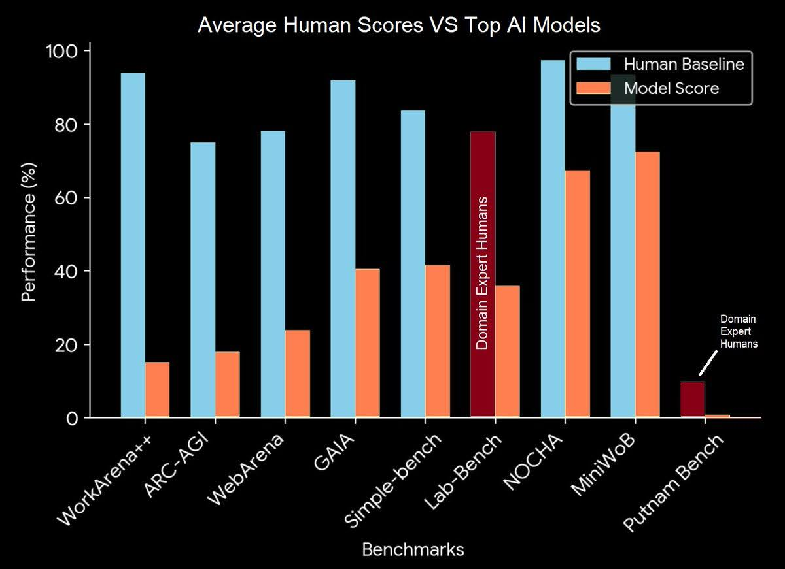{.column-margin} 

<!-- ## New benchmarks are being produced that stretch the limits of human ability.

The Financial Times [reports](https://www.ft.com/content/866ad6e9-f8fe-451f-9b00-cb9f638c7c59) *“Tech groups are rushing to redesign how they test and evaluate their artificial intelligence models, as the fast advancing technology surpasses current benchmarks.”*  

Scale.ai and the CAIS have created a new eval called [“humanity’s last exam](https://agi.safe.ai/submit\\).” When released in January 2025 frontier model performance was at single-digits- by July 2025 several frontier models have surpassed 20% with Grok 4 claiming (with tool use such as internet browsing) results of up to 50%. 

Epoch.AI recently compiled a benchmark, [FrontierMATH]((https://epochai.org/frontiermath/the-benchmark)), of particularly challenging mathematical problems (“expert-level mathematics problems that specialists spend days solving”). They have since created a new level (Tier 4) of even harder such problems after frontier models have made progress on the earlier levels.  -->

## LLMs show limited ability to perform actions in the real world.  

LLMs are able to perform some simple discrete multi-turn tasks in simulated computer environments but have yet to saturate benchmarks of simple web-browsing tasks such as [Tau-Bench](https://hal.cs.princeton.edu/taubench_retail) and [OS-world](https://arxiv.org/pdf/2404.07972).

- Anthropic reported on a [2025 project](https://www.anthropic.com/research/project-vend-1)   for Claude to run as a "shopkeeper" for a vending machine inside the Anthropic offices. They found that the agent hallucinated payment accounts, sold items at a loss, and got talked into severe discounts.

- Vending-Bench (@backlund2025vending) is a fully simulated vending machine setup: frontier agents routinely drive the business to bankruptcy within a few in-game weeks, suggesting a lack of long-term navigation abilities. 


## LLMs show limited ability to play single-player and multiplayer games.

Frontier LLMs struggle playing games that are simple for children to solve.
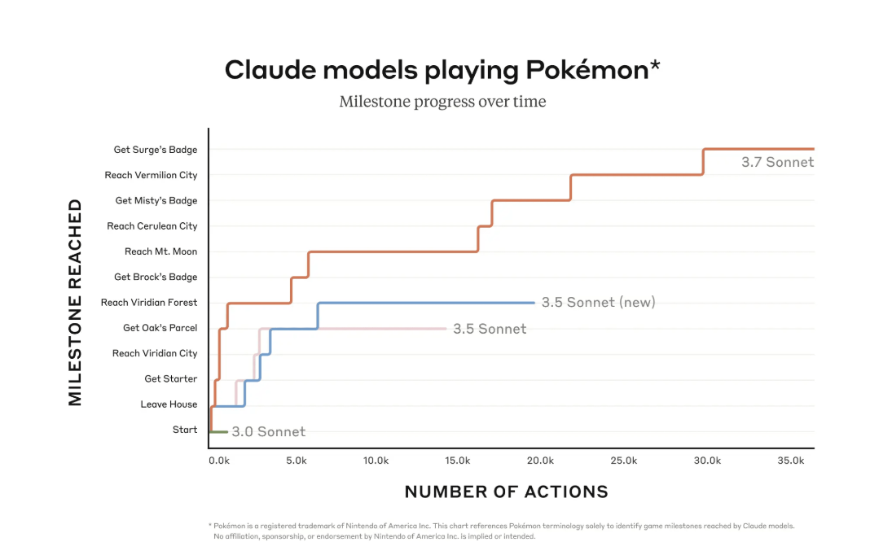{.column-margin} 

- Paul Calcraft [discusses](https://x.com/paul_cal/status/1890824247792037898) the state of LLM-gameplaying in early 2025: their performance in tic-tac-toe, connect 4, codenames, and chess, is still well below that of human experts.

- @payne2025strategic find that LLMs are "highly competitive" with the most successful strategies in playing iterated prisoners dilemma games.
- LMGame-Bench (@hu2025lmgamebench) finds that as of early 2025, LLMs are still below human performance across 6 computergames: Sokoban, Super Mario Bros, Tetris, 2048, Candy Crush, and Ace Attorney.
- TextQuests (@phan2025textquests) find as of August 2025 LLMs are unable to solve text-based adventure games that would take human players around 30 hours and hundreds of actions to solve without assistance. With clues granted recent models are able to make greater progress- whilst no model prior to 2025 is able to solve any adventure completely, GPT-5 is able to solve 5/25. 

## LLMs hallucinate with obscure or long-form answers.

LLMs struggle with reliability and often make up plausible-sounding but factually incorrect hallucinations.

- GPT-4o and o1-preview hallucinate 30-60 % of the time when asked obscure factual questions, e.g. “Which Dutch player scored an open-play goal in the 2022 Netherlands vs Argentina game in the men’s FIFA World Cup?” [^12]. 
- When evaluated on a proprietary benchmark of open-ended questions they included incorrect facts in their answers around 80 % of the time [^13].

However, there has been recent progress made in reducing hallucination rates. GPT-5, released in August 2025, had six times fewer hallucinations than o3 as measured by LongFact -@wei2024longformfactuality and FActScore -@min2023factscore.

## LLMs struggle to give calibrated answers.

LLMs usually are not aware of what they know or do not know.

- @kadavath2022know have found that large-parameter models are fairly well calibrated in standard benchmarks. 
- However a recent OpenAI -@openai2024simpleqa study found that models are fairly overconfident on tests of obscure facts:  
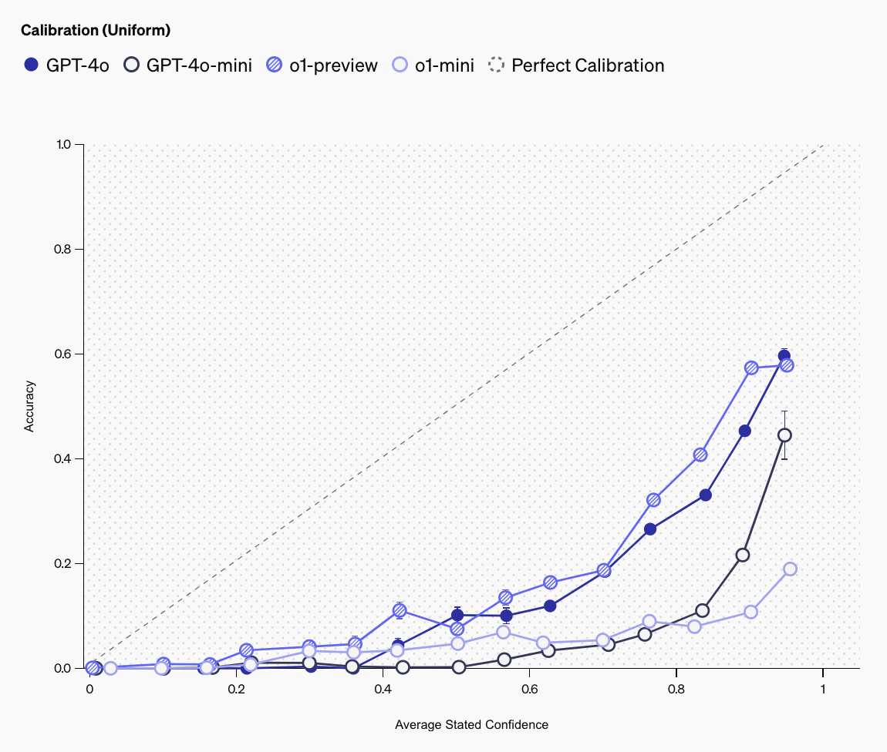{.column-margin}

- A Metactulus study in October 2024 found that pro human forecasters were "signficantly better" than top bots on a set of 113 forecasting questions across various domains (eg. politics, economics, the rate of technological progress, etc ) and that the bots displayed a positive bias (overestimating the likelihood of all events on average)[^26]. 

<!-- #      LLM Benchmarks: Factor Analysis

## LLMs struggle with tasks that are logically complex (and costly to verify at scale) and those that require UX usage.  

An analysis of 40 publicly available benchmarks found six that LLMs still find particularly challenging (Jun 2025): 

 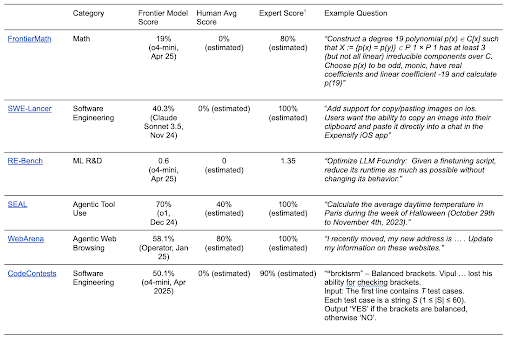{.column-margin}

## The Human Time-to-Complete a task is the best univariate predictor of LLM success rates

Taking correlations between LLM performance in 40 benchmarks across nine different features, the human time-to-complete had the highest (negative) correlation. 

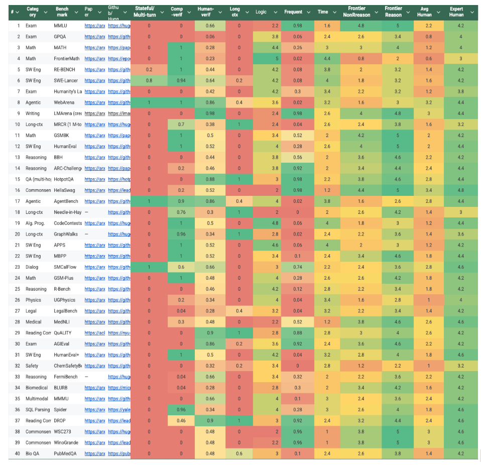

However, the strength of this correlation is mainly due to the strong correlation between human time-to-complete and whether a turn requires multiple-turns or is highly logically complex. Indeed, in a multivariable regression, time-to-complete has one of the weakest effects of any task attribute. 

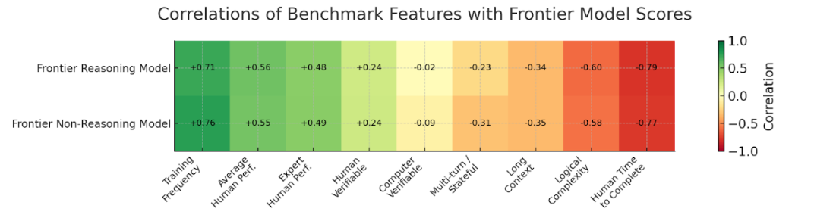

## The ease of verifying the outputs of a task is the most important attribute in leading LLMs to be successful at a task.

If a task’s outputs are easily verifiable by both expert humans and a computer this is associated with a 1.4 unit (on a five-point scale) increase in frontier LLM performance on average. 

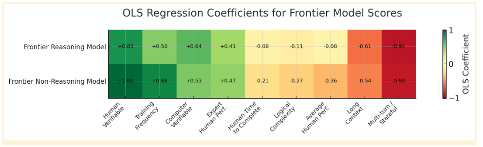{.column-margin} 

The degree to which the verification can occur autonomously (by computers not expert humans) has gotten more important with reasoning models.   -->

# LLM Augmentation Studies

We define AI "augmentation" as the effect of combined AI and human ability, compared to human-alone ability. These are sometimes also called "uplift" or "centaur" studies.

## The productivity effects of LLM augmentation varies widely


These RCTs compare behavior of workers with and without access to an AI system:

::: {.column-page}

| Domain               | Reference(s)                     | Productivity                        | Quote                                                                                                                                                                                                                  |
| -------------------- | -------------------------------- | ----------------------------------- | ---------------------------------------------------------------------------------------------------------------------------------------------------------------------------------------------------------------------- |
| Software engineering | @cui2024software                 |                                     |                                                                                                                                                                                                                        |
|                      | @hoffmann2025generative |                                     |                                                                                                                                                                                                                        |
|                      | @gao2024github                   | +9% pull requests/day               | “Accenture developers saw an 8.69% increase in pull requests … a 15% increase to the pull request merge rate … an 84% increase in successful builds … developers accepted around 30% of GitHub Copilot’s suggestions.” |
|                      | @peng2023developerproductivity   | +126% tasks/minute                  | "The treatment group, with access to the AI pair programmer, completed the task 55.8% faster than the control group." (implies +126% tasks/minute)                                                                     |
|                      | @becker2025developerproductivity | -16% tasks/minute                   | "Allowing AI actually increases completion time by 19%—AI tooling slowed developers down." (implies -16% tasks/minute)                                                                                                 |
| Consultants          | @dellacqua2023consultants        |                                     |                                                                                                                                                                                                                        |
| Writing tasks        | @noy2023writing                  |                                     |                                                                                                                                                                                                                        |
| Call centre workers  | @brynjolfsson2023callcenter      | +15% issues/hour                    | “Access to AI assistance increases worker productivity, as measured by issues resolved per hour, by 15% on average, with substantial heterogeneity across workers.”                                                    |
| Translators          | @merali2024scaling               | +24% translations/minute            | “With access to any AI model [time taken] was reduced ... [by] 31.1%.” (=+24% translations/minute)                                                                                                                     |
| Entrepreneurs        | @otis2024entrepreneurs           | no statistically significant effect |                                                                                                                                                                                                                        |
| Legal tasks          | @choi2023legal                   | +12%--+32% tasks/minute             |                                                                                                                                                                                                                        |
| Radiology            | @agarwal2024radiology            | +0.2%                               |                                                                                                                                                                                                                        |
|                      |                                  |                                     |                                                                                                                                                                                                                        |
:::


   
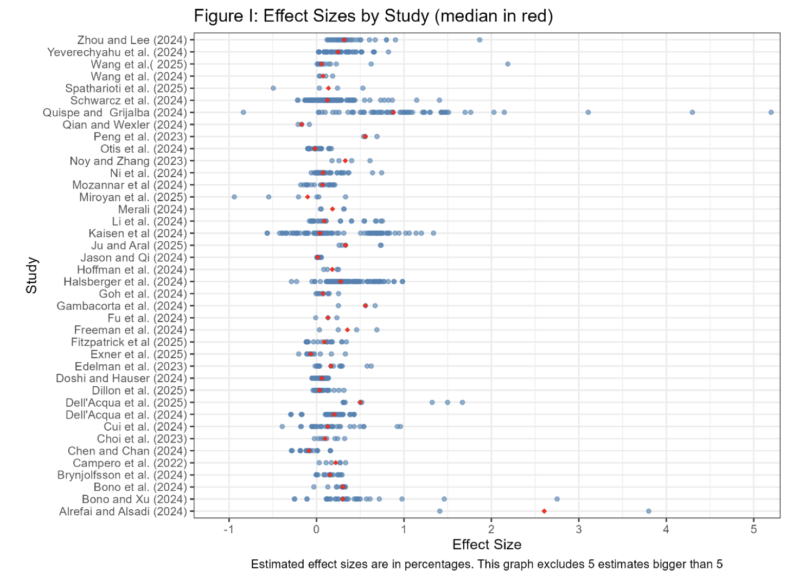{.column-margin}

@coupe2025impact survey 45 studies of the impact of genAI tools on productivity, with an average productivity effect of +17%, however with much variation. They also find strong signs of selection in estimates, suggesting the true effects are likely smaller.

@vaccaro2024humanai survey 106 studies published between 2020 and 2023. They found:

   > on average, human–AI combinations performed significantly worse than the best of humans or AI alone (Hedges’ g = −0.23; 95% confidence interval, −0.39 to −0.07). Second, we found performance losses in tasks that involved making decisions and significantly greater gains in tasks that involved creating content. Finally, when humans outperformed AI alone, we found performance gains in the combination, but when AI outperformed humans alone, we found losses.


## There is some evidence of larger effects on lower-productivity workers

The following RCTs find that augmentation has a larger relative effect on workers with lower pre-experimental productivity levels:

- @brynjolfsson2023callcenter: "Less experienced and lower-skilled workers improve both the speed and quality of their output while the most experienced and highest-skilled workers see small gains in speed and small declines in quality."
- @noy2023writing: "there is a correlation of 0.49 between a control participant’s average grade on the first task and their average grade on the second task. In the treatment group, initial inequalities are half-erased by the treatment: the correlation between first-task and second-task grades is only 0.25"
- @choi2023legal
- @peng2023developerproductivity
  - Magnitude: "The treatment group, with access to the AI pair programmer, completed the task 55.8% faster than the control group."

## There are few benchmarks of augmentation

- @haupt2025position argues for creating standardized benchmarks of augmentation/uplift they refer to as "centaur" evaluations.

## Human + AI teams do not reliably outperform the better of human or AI performance individually

- @vaccaro2024humanai across 16 decision-making tasks hybrid pairs under-performed the top human-or-AI agent in 70 % of cases, though they sometimes added creative diversity. 

- @agarwal2024radiology in a radiology-diagnosis experiment, human–AI collaboration improved accuracy by only 0.2 pp over AI-only and did **not** outperform selective automation.  

## Humans often misperceive the abilities of LLMs.

- @dreyfuss2025human find “projection of human difficulty onto AI predictably distorts subjects' beliefs”.

- @vafa2024humangeneralization say “We collect a dataset of 19K examples of how humans make generalizations across 79 tasks from the MMLU and BIG-Bench benchmarks … based on short interactions, humans reach overconfident conclusions about the capabilities of the largest models.” 

 - @agarwal2024radiology find that radiologists do not use AI data efficiently. 

 - @becker2025developerproductivity find that experienced software engineers inaccurately believe that they have experienced productivity speedups when using AI tools. 


However there are limits on what these studies can tell us.

They measure short-run outcomes, but in most jobs the performance cannot be easily measured with short-run outcomes. E.g. it is challenging to interpret experiments which measure the effect of LLMs on office workers’ measurable activities (emails, pull requests).

 The effects of AI are highly heterogenous across tasks and occupations. 

 It is difficult to extrapolate the results into the future given the advance in model capabilities (@merali2024scaling attempts to fit model scale to productivity.) 

These experiments often do not measure the ability of models to perform tasks autonomously. 

These experiments do not incorporate general equilibrium effects. 

A similar discussion of the limitations of augmentation experiments is made in a recent [Andrey Fradkin blog post](https://empiricrafting.substack.com/p/sci-fi-economics?r=365z3v&utm_campaign=post&utm_medium=web&triedRedirect=true).

<!-- ## The correlation between different occupational exposure indices is fairly strong.

-[Eloundou et al. (2024)](https://www.science.org/doi/abs/10.1126/science.adj0998)*: “We find generally positive and statistically significant correlations between our LLM exposure measures and previous measurements targeting software and AI.”*   -->


# Implications for LLM Economic Impact

## The price of inference for a fixed level of capability has been falling at 10X/year or faster.

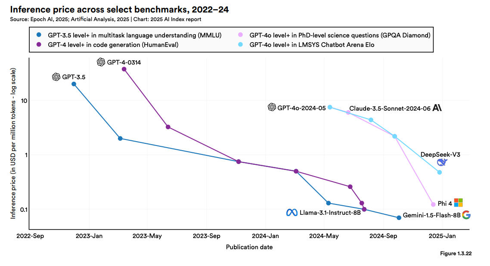{.column-margin}

- @maslej2025aiindex estimate that inference costs, for a given level of intelligence, fell over 2022-2024 at annual rates exceeding 10X/year.

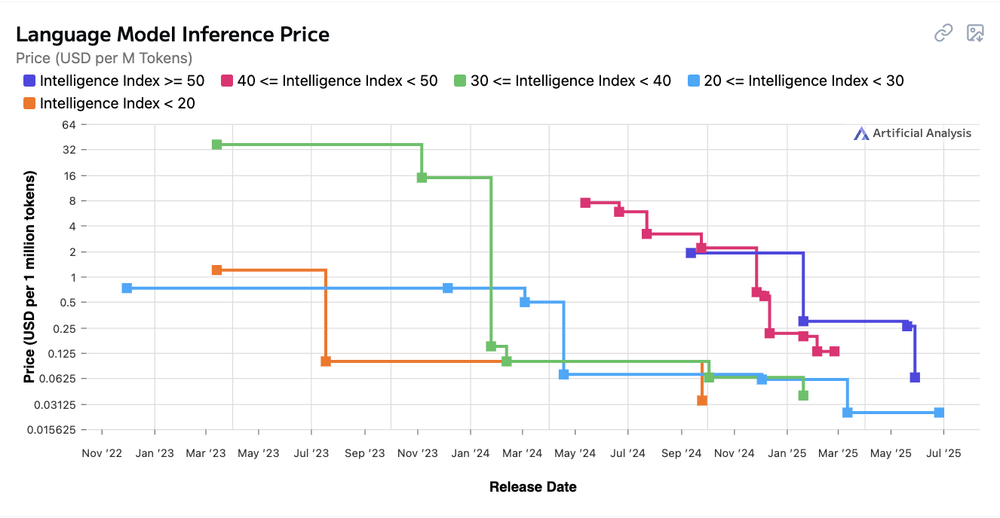{.column-margin}

- [Artificial Analysis](https://artificialanalysis.ai/trends) track per-token price trends since 2022: within each tier of model intelligence, the price typically halves every few months.

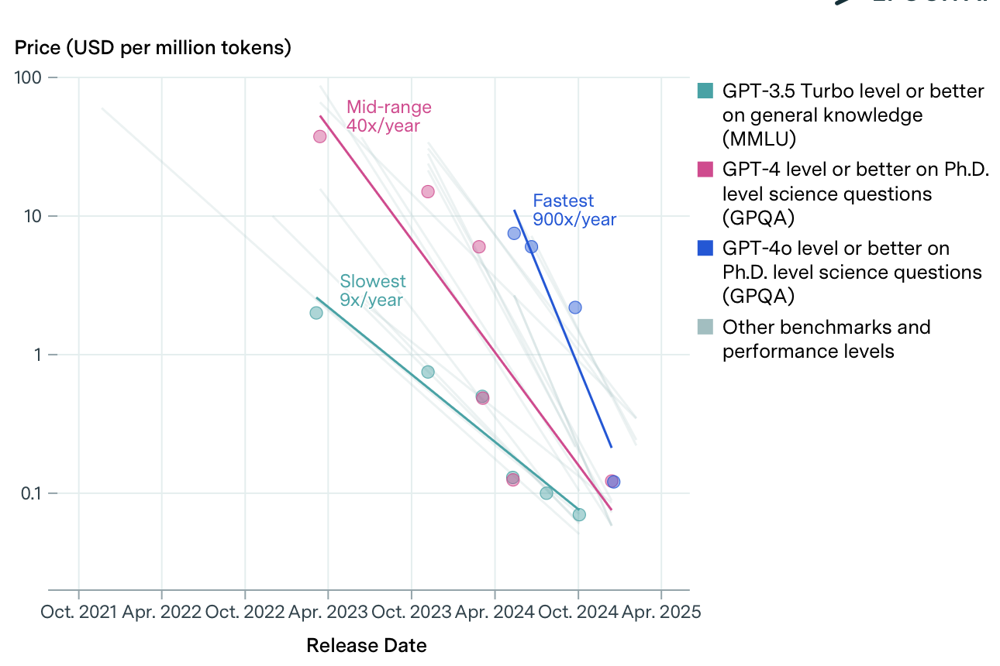{.column-margin}

- @epoch2025llminferencepricetrends find price declines over 2023-2025 from between 9X/year (for gpt-3.5 ability on MMLU), up to 900X/year (for gpt-4o ability on GPQA).


## The cost of inference for frontier capabilities has remained roughly stable.

The retail price of intelligence is determined by the compute requirement, the cost of compute, and the markup. Also note that the per-token price can be very different from the per-request price for reasoning models. 

- [Artificial Analysis](https://artificialanalysis.ai/trends) show that the per-token price of frontier intelligence over time shows no clear trend (the chart above). Note that this chart does not include the current highest-tier models, as of July 16 Grok4 has a price of $6/M tokens.

- The price of compute has been relatively stable over 2023-2025, with A100 priced at around $2/hour (see Lambda Cloud pricing @lambdalabs_gpu_pricing).


## Inference costs of serving a model are now roughly proportional to the initial training costs.

There is a tradeoff between training cost and inference cost through model size. Larger models will have higher inference costs. 

- @epoch2024optimallyallocating concludes AI labs should spend "comparable resources in training and running inference". 


## LLMs are almost always cheaper than humans


@metr2024capability compare the cost of humans and LLMs to do a variety of tasks, they say “when agents *can* do a task, they can often do so at a fraction of the cost of humans.” 

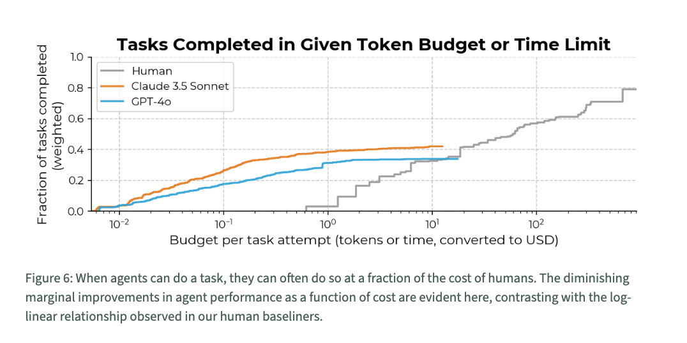{.column-margin}

Similarly @metr2025gpt5evaluation finds:

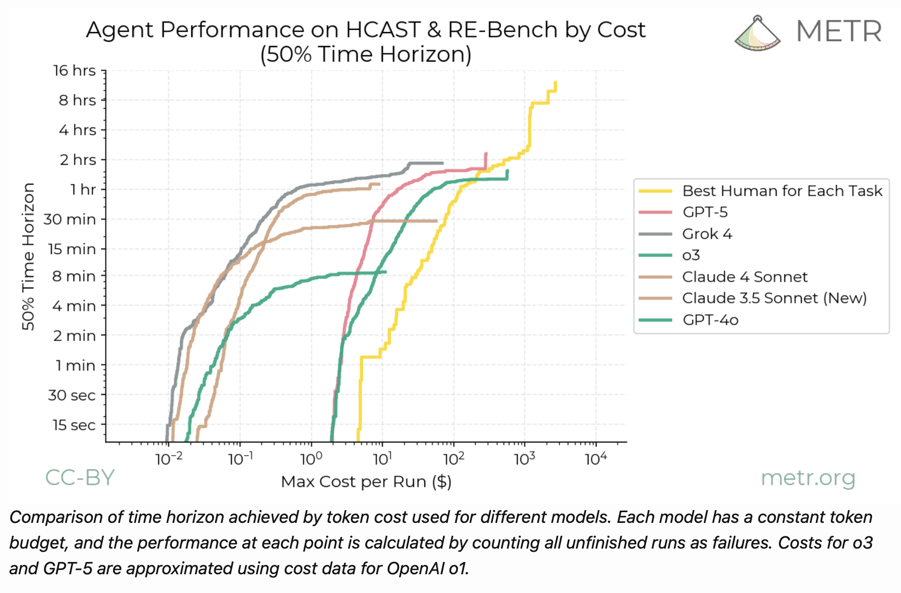{.column-margin}


Exceptions:

- Computer transcription was for a period more accurate but less cost-effective than humans.
- Reasoning tasks with high test-time expenditure ([ARC-AGI](https://arcprize.org/arc-agi)))
- [Svanberg et al. (2024)](https://futuretech-site.s3.us-east-2.amazonaws.com/2024-01-18+Beyond_AI_Exposure.pdf) argue that "only 23% of worker compensation “exposed” to AI computer vision would be cost-effective for firms to automate because of the large upfront costs of AI systems." However this is almost entirely fixed costs (data collection, fine tuning, scaffolding), not marginal costs.

## The economic impact of LLMs has been modest so far

Around 1/2 of US adults regularly use an LLM-based chatbot.
: The productivity impact is perhaps 0.1-1% of GDP:

   - @bick2024rapid: 0.1-0.9% aggregate productivity boost through time-savings on work tasks.
   - @humlum2025large: 3% average self-reported time saving among users.
   - @collis2025wta: genAI app users report valuations (Willingness-to-Accept) equivalent to around 0.3% of GDP ($98 per user, $97B total).

Probably the biggest economic impact is on home production.
: Working on a paper documenting ChatGPT use. Note that Anthropic and Microsoft papers only focus on use at work tasks.

Enterprise impacts are still small.
: Most enterprises have adopted AI in some form, but they typically report small effects on revenue or costs.

@maslej2025aiindex say:

   > "Most companies that report financial impacts from using AI within a business function estimate the benefits as being at low levels. 49% of respondents whose organizations use AI in service operations report cost savings, followed by supply chain management (43%) and software engineering (41%), but most of them report cost savings of less than 10%."


```{tikz}
#| fig-column: margin
\begin{tikzpicture}[scale=4]
  \draw[<->] (1,0)  node[right] {time}--(0,0) -- (0,1);
  \draw[gray!50!white] (.2,1)--(.2,0) node[left,rotate=90,gray] {2023};
  \draw[gray!50!white] (.4,1)--(.4,0) node[left,rotate=90,gray] {2024};
  \draw[gray!50!white] (.6,1)--(.6,0) node[left,rotate=90,gray] {2025};
  \draw[gray!50!white] (.8,1)--(.8,0) node[left,rotate=90,gray] {2026};
  \draw[gray!50!white] (1,1)--(1,0) node[left,rotate=90,gray] {2027};
  \draw[dashed] (0.45,1)--(0.45,0);
  \draw[domain=0.1:.65,smooth,samples=100,blue!25!white,very thick] plot (\x,{0.08*exp(4*\x)});
  \draw[domain=0.1:.45,smooth,samples=100,blue,very thick] plot (\x,{0.08*exp(4*\x)});
  \draw[blue,very thick] (0.45,0.48)--(0.65,0.48)  node[right,align=left] {frozen capabilities};

  \draw[domain=0.1:.65,smooth,samples=100,red!25!white,very thick] plot (\x,{0.03*exp(4*\x)});
  \draw[domain=0.1:.45,smooth,samples=100,red,very thick] plot (\x,{0.03*exp(4*\x)});
  \draw[red,very thick] plot[smooth,tension=1] coordinates{(0.45,0.18) (0.55,0.24) (0.65,0.28)}
      node[right,align=left] {realized value of AI};
\end{tikzpicture}
```


**Most growth in impact is likely due to capabilities rather than diffusion.** Thought experiment: if we had frozen capabilities at gpt-3.5, gpt-4.0, what would be the impact today?

We can observe the causal effect of model improvement on existing cohorts with AB tests, it is harder to attribute user acquisition.


## We may not be able to direct technical change

**Many economists have said we should shift the focus of our AI research:**

@brynjolfsson2023turing

> "an excessive focus on developing and deploying [human-level AI] can lead us into a trap ... when AI is focused on augmenting humans rather than mimicking them, then humans retain the power to insist on a share of the value created"

@acemoglu2021ai:

> "our current trajectory automates work to an excessive degree while refusing to invest in human productivity

**This may not be possible:** augmenting AI and automating AI may be the same AI.

If there is a single latent factor of model ability, then work to train an augmenting model looks very similar to work to train an automating model.  The ability to significantly steer AI capabilities seems limited.

## A univariate model of machine and human intelligence will be a poor fit

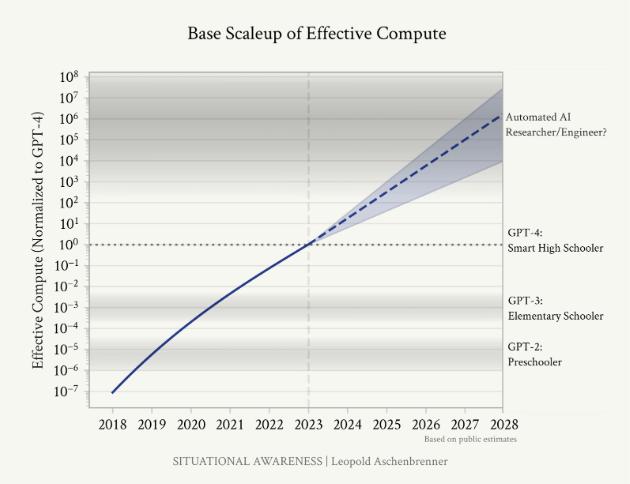{.column-margin}

We sometimes describe AI capability by human equivalent, e.g. years of education (@aschenbrenner2024situational).

What would a two-factor model look like?

- LLMs have PhD-level knowledge and reasoning.
- LLMs have preschool-level tactics.

## Wages are unlikely to be pinned down by the price of compute

Some models feature "equilibrium task-sharing": humans perform tasks that computers are able to do, but it is too expensive for computers:

- @trammell2023economic
- @ide2024artificialintelligenceknowledgeeconomy
- Noah Smith ([2024](https://www.noahpinion.blog/p/plentiful-high-paying-jobs-in-the)) on comparative advantage and wages.
- @acemoglu2024simple
- @jones2025aiinrnd assumes that all tasks which an AI can do will be done by an AI in equilibrium (assumption 1, p8). However he also expects that significant progress through a reduction in the price of AI tasks.

We argued above that equilibrium task-sharing has historically been true only for a small share of tasks. 

Equilibrium task-sharing would require either:

1. A dramatic increase in the price to perform a task:
   - An increase in the compute required for new tasks – the price of frontier inference has been steady.
   - An increase in compute costs – GPU rental prices have been steady, and the purchase/rent ratio has been stable.
   - An increase in margins.
2. A dramatic drop in human wages.


# Appendix / Offcuts

[Jason Wei blog post](https://www.jasonwei.net/blog/asymmetry-of-verification-and-verifiers-law) *"The ease of training AI to solve a task is proportional to how verifiable the task is. All tasks that are possible to solve and easy to verify will be solved by AI".* Five specific factors:

   1. Objective truth: everyone agrees what good solutions are
   2. Fast to verify: any given solution can be verified in a few seconds
   3. Scalable to verify: many solutions can be verified simultaneously
   4. Low noise: verification is as tightly correlated to the solution quality as possible
   5. Continuous reward: it’s easy to rank the goodness of many solutions for a single problem


# References


[^11]:  https://www.wired.com/story/nvidia-hardware-is-eating-the-world-jensen-huang/

[^12]: https://assets.ctfassets.net/kftzwdyauwt9/67qJD51Aur3eIc96iOfeOP/71551c3d223cd97e591aa89567306912/o1_system_card.pdf

[^13]: https://assets.ctfassets.net/kftzwdyauwt9/67qJD51Aur3eIc96iOfeOP/71551c3d223cd97e591aa89567306912/o1_system_card.pdf

[^22]: https://cdn.openai.com/pdf/2221c875-02dc-4789-800b-e7758f3722c1/o3-and-o4-mini-system-card.pdf

[^26]: https://www.metaculus.com/notebooks/28784/aibq3results/

[^27]: https://www.metaculus.com/questions/7024/ai-to-beat-humans-on-metaculus/

